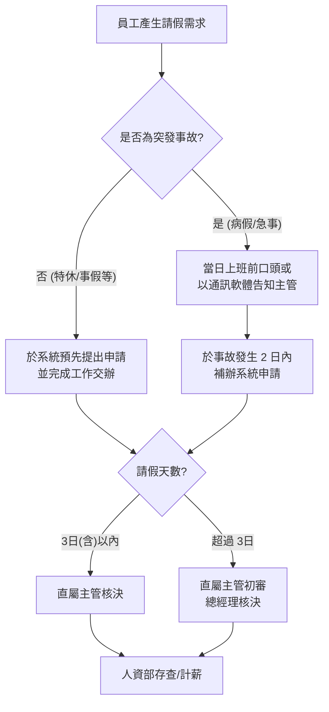

# 員工請假管理程序 (HR-PR-ATT-01)

## 一、 目的
為規範員工請假作業程序，確保公司人力調配順暢，並維護員工請假權益，特訂定本辦法。

## 二、 適用範圍
本公司全體員工。

## 三、 請假程序圖

## 四、 請假手續與規定

### 1. 系統申請
- 本公司一律使用 **「104 企業大師」** 系統辦理請假。
- 員工應事先於系統填寫請假單，敘明理由與時間，經核定後方可離開崗位。

### 2. 緊急請假
- 如遇急病或臨時重大事故，應先於上班前以電話、通訊軟體告知直屬主管。
- 應於事故發生起 **2 日內** 委託他人或自行於系統補辦手續。
- 證明文件（如診斷證明、訃聞等）應於 **15 日內** 上傳系統或提交至人資部。

### 3. 申請時限規範
為利於工作安排，請假應遵循以下時限要求：
- **事假、特休 (1日內)**：應於 1 日前提出。
- **長假 (2~4日)**：應於 3 日前提出。
- **長假 (5日以上)**：應於 1 週前提出。
- **婚假**：應於 2 週前提出。

## 五、 請假計算單位與限制

| 假別 | 最小請假單位 | 備註 |
| --- | --- | --- |
| **特別休假、事假、病假、家庭照顧假** | 0.5 小時 | 依辦公時間計算 |
| **婚假、喪假、產檢假、陪產檢及陪產假** | 0.5 日 (4小時) | |
| **其餘假別** | 1 日 | |

*註：各類假別之詳細日數與給薪標準，請參照《員工假別說明表》(HR-FM-ATT-01)。*

## 六、 代理人制度

### 1. 代理人選擇原則
員工請假前應依下列優先順序指派職務代理人，並落實工作交接，確保業務不中斷：
- **第一順位**：同部門、同職等之同仁（平級代理）。
- **第二順位**：直屬主管（向上代理）。
- **第三順位**：由主管指定之跨部門對等人員（跨部門代理）。

### 2. 管理職(主管)特別規範
為維護公司決策品質與簽核權限之嚴謹性，管理職人員請假時之代理人設定需符合以下要求：
- **權限對等**：處級（含）以上主管請假時，其系統之「簽核代理人」應選擇 **同級主管** 或 **上級主管（總經理）**。
- **禁止向下代理**：嚴禁選擇非主管職或職等落差過大之基層同仁，作為涉及管理權責（如：預算審核、人事簽核、合約決策）之系統代理人。
- **事務委託**：日常行政或例行業務可委託下屬協助執行，但正式系統審核權仍須由上述核定之代理人行使。

### 3. 代理人責任
- 代理人應於請假單中簽核確認（或於系統點選同意），代表已知悉代理期間之工作內容。
- 代理人於代理期間內，對其代理簽核之文件與決策負同等行政責任。

## 七、 銷假與變更
- 假期屆滿應準時銷假上班，如需續假應依上述程序重新辦理。
- 凡未辦理請假手續、假滿未續假或請假有虛偽情事者，均以 **「曠職」** 論。

## 八、 罰則
- 曠職者除當日不給薪外，將嚴重影響年度績效評核。
- 連續曠職 3 日或一個月累計 6 日者，公司得不經預告終止勞動契約。
