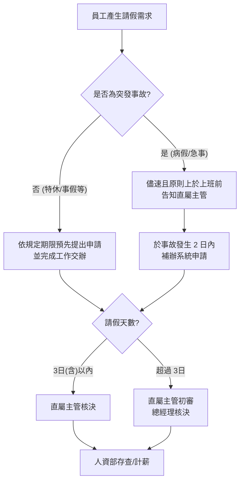

# 員工請假管理程序 (HR-PR-ATT-01)

## 文件資訊

| 欄位 | 內容 |
| --- | --- |
| 文件編號 | HR-PR-ATT-01 |
| 文件名稱 | 員工請假管理程序 |
| 文件類型 | 程序書 |
| 版本 | v0.3 |
| 狀態 | 草稿（未發行） |
| 制定單位 | 人事課 |
| 制定者 | 蔡家瑋 |
| 審核者 |  |
| 核准者 |  |
| 生效日 |  |
| 最後更新日 | 2026-07-07 |

## 文件履歷

| 版本 | 日期 | 修訂內容 | 制定者 | 審核者 | 核准者 |
| --- | --- | --- | --- | --- | --- |
| v0.1 |  | 初版草案建立 | 蔡家瑋 |  |  |
| v0.2 | 2026-07-07 | 補充提前請假原則、臨時請假補辦及考勤影響說明 | 蔡家瑋 |  |  |
| v0.3 | 2026-07-07 | 調整可預見請假申請時限，並簡化請假計算單位引用方式 | 蔡家瑋 |  |  |

## 一、 目的
為規範員工請假作業程序，確保公司人力調配、工作交接及代理安排順暢，並維護員工依法及依公司制度請假之權益，特訂定本辦法。

請假不只是系統填單程序，也會影響部門排班、客戶服務、工作交付及同仁代理負擔。員工如已可預見請假需求，應儘早提出申請並完成交接；臨時請假或事後補單雖不當然禁止，但若非屬不可預見或正當緊急情形，仍可能納入考勤紀錄、主管管理評估及年度績效評核之參考。

## 二、 適用範圍
本公司全體員工。

## 三、 請假程序圖

## 四、 請假手續與規定

### 1. 系統申請
- 本公司一律使用 **「104 企業大師」** 系統辦理請假。
- 員工應事先於系統填寫請假單，敘明理由與時間，經核定後方可離開崗位。
- 已知或可預見之請假需求，應依本程序規定期限預先提出，不宜等到當日或事後補單。
- 請假申請應同時完成工作交接、代理人設定及必要資料移交，避免影響部門運作。

### 2. 緊急請假
- 如遇急病、家庭突發事故或其他不可預見之重大情形，應儘速且原則上於上班前以電話、通訊軟體告知直屬主管。
- 應於事故發生起 **2 日內** 委託他人或自行於系統補辦手續。
- 證明文件（如診斷證明、訃聞等）應於 **15 日內** 上傳系統或提交至人資部。
- 臨時請假或事後補單如有正當理由並完成補辦程序，得依實際情形受理；但若經常發生、未即時通知、未完成交接，或無法提出合理說明，主管及人事課得列入考勤異常紀錄。

### 3. 申請時限規範
為利於工作安排、代理交接及主管排程，可預見之請假應依下列原則提前提出：
- **半日或 1 日內之特休、事假或可預先安排之假別**：原則上應於 3 個工作日前提出。
- **連續 2 至 4 日之請假**：原則上應於 7 日前提出。
- **連續 5 日以上之請假**：原則上應於 14 日前提出。
- **婚假、長期療養、育嬰留職停薪或其他可提前規劃之長期假別**：原則上應於 30 日前提出；如因事件發生時間或證明文件取得時間限制，得先告知主管及人事課，再補齊正式申請。

上述時限為可預見請假之管理原則；急病、突發家庭事故、喪假或其他不可預見情形，依緊急請假程序辦理。

### 4. 提前請假與考勤影響
- 員工依規定提前申請並完成交接者，視為正常請假程序，不因請假本身影響考勤成績。
- 未依時限提前申請、當日臨時請假或事後補單者，應說明原因；如原因合理且具不可預見性，依緊急請假程序辦理。
- 如請假需求可預見卻未提前提出，或反覆發生臨時請假、補單逾期、未通知主管、未完成代理交接等情形，雖仍得依假別規定核假，仍可能影響考勤成績、主管工作態度評估及年度績效評核。
- 主管審核請假時，應區分「請假權益」與「程序遵循」。員工依法及依制度可申請之假別不得任意拒絕，但程序未遵循之情形得另依考勤管理及績效評核規定記錄。

## 五、 請假計算單位與限制

各類假別之請假單位、日數、給薪標準、證明文件及其他限制，請參照《員工假別說明表》(HR-FM-ATT-01)。本程序僅規範請假申請、通知、補辦、代理交接及考勤管理原則。

## 六、 代理人制度

### 1. 代理人選擇原則
員工請假前應依下列優先順序指派職務代理人，並落實工作交接，確保業務不中斷：
- **第一順位**：同部門、同職等之同仁（平級代理）。
- **第二順位**：直屬主管（向上代理）。
- **第三順位**：由主管指定之跨部門對等人員（跨部門代理）。

### 2. 管理職(主管)特別規範
為維護公司決策品質與簽核權限之嚴謹性，管理職人員請假時之代理人設定需符合以下要求：
- **權限對等**：處級（含）以上主管請假時，其系統之「簽核代理人」應選擇 **同級主管** 或 **上級主管（總經理）**。
- **禁止向下代理**：嚴禁選擇非主管職或職等落差過大之基層同仁，作為涉及管理權責（如：預算審核、人事簽核、合約決策）之系統代理人。
- **事務委託**：日常行政或例行業務可委託下屬協助執行，但正式系統審核權仍須由上述核定之代理人行使。

### 3. 代理人責任
- 代理人應於請假單中簽核確認（或於系統點選同意），代表已知悉代理期間之工作內容。
- 代理人於代理期間內，對其代理簽核之文件與決策負同等行政責任。

## 七、 銷假與變更
- 假期屆滿應準時銷假上班，如需續假應依上述程序重新辦理。
- 凡未辦理請假手續、假滿未續假、未完成補辦程序或請假有虛偽情事者，得依情節以 **「曠職」** 或考勤異常處理。

## 八、 考勤與罰則
- 請假程序遵循情形得作為考勤成績、工作態度、主管管理評估及年度績效評核之參考。
- 臨時請假或事後補單不當然視為違規；但若無正當理由、反覆發生或影響工作交接，得依考勤異常記錄。
- 曠職者除當日不給薪外，將嚴重影響年度績效評核。
- 連續曠職 3 日或一個月累計 6 日者，公司得不經預告終止勞動契約。
