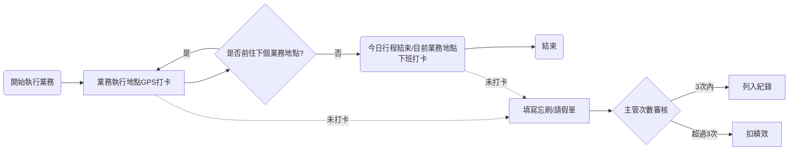

# 業務人員出勤管理程序 (HR-PR-ATT-03)

## 一、 目的與適用範圍

為規範在外執行公務之業務人員出勤管理，確保打卡紀錄之真實性與公平性，特訂定本辦法。所有業務人員之每日出勤起訖與行程紀錄，均依本規範辦理。

**隱私權與數據聲明**：公司要求使用 GPS 打卡僅作「出勤與工時紀錄、差旅費核銷稽核」之用途，並僅限於約定之工作時間內讀取定位資訊，絕不挪作他用，以保障員工個人隱私。

## 二、 流程圖

## 三、 出勤打卡規範

### 1. 打卡工具與適用情境

- **單一打卡工具**：全體業務人員一律統一使用「104企業大師」APP 進行 GPS 打卡，具體定位與備註要求請參照《104企業大師手機打卡操作指南》(HR-WI-ATT-01)。
- **定位防弊與稽核機制**：公司將透過輔助系統自動結合 GPS 紀錄與客戶拜訪紀錄進行交叉比對。若發生以下情形，系統將主動標示異常並提示主管，員工須負舉證與說明之責：
  1. 打卡地點周遭無對應之客戶紀錄。
  2. 實際打卡時間與預定拜訪的客戶時間落差過大。
  3. 系統里程預估與實際申報里程差距過大。
- **嚴禁造假**：嚴禁使用虛擬定位軟體 (Fake GPS) 或請他人代打卡。一經查獲有造假出勤紀錄之情事，**最嚴重可視同嚴重違反工作規則**，公司得依勞基法相關規定予以嚴懲或免職。

### 2. 每日打卡時間規定

- **上班打卡（06:30 ~ 09:30）**：
  - 員工需於規定時間內完成當日首次打卡。
  - _遲到判定原則_：若於 09:30 前完成打卡，即使當下地點與原訂客戶不同，亦不算遲到；若超過 09:30 打卡，則將依照實際出勤地點的距離與狀況，由主管進行個案判定與審核。
- **下班打卡（16:30 ~ 17:59）**：
  - 今日所有行程結束後，請在最後一個行程結束的地點附近進行當日的「下班打卡」。
  - _超時與加班處理_：若因客訪行程較晚，超過 18:00 才打下班卡，系統仍會如實記錄下班時間。員工須於系統主動勾選超時原因（個人因素或實際加班）；若屬實際加班，請務必依循公司常規《加班申請作業程序》(HR-PR-06) 辦理。
  - _交際應酬規範_：**一般交際應酬不視為加班情形**。若有特殊必要情況需認定為加班，請事前提出專案申請，經主管核准後方可計入加班工時。

### 3. 行程轉換規範

- 於抵達客戶地點、展覽會場、或開始進行業務開發（含抵達正確地點或周遭停車場）時，進行 GPS 打卡。
- 當單一行程結束並前往下一站時，於**抵達下一站（或開始下一段業務）時需再次進行 GPS 打卡**。
- _中途私人行程（請假）_：若於公務行程中穿插私人行程（包含各類請假），應於私人行程開始前與結束後，確實進行下班打卡與再上班打卡，並主動與主管報備，以明確區分公私界線與工時計算。

## 四、 異常處理與懲處機制

### 1. 異常申請

- 若在上班、行程轉換或下班環節發生「未打卡」（含忘記打卡、臨時請假等），員工必須至系統填寫「**忘刷/請假申請單**」，並提交直屬主管審核。
- **系統異常備案**：若因「104企業大師」APP 發生異常導致無法打卡，請務必於當下**將異常畫面截圖**，並於事後填寫「忘刷申請單」時，將該截圖作為附件檢附以供查核。

### 2. 績效扣分規則

忘刷紀錄將以「**月**」為單位進行累計與稽核：

- **每月 3 次（含）以內**：經主管核准後正常列入出勤紀錄，不予扣分。
- **每月超過 3 次**：除列入出勤紀錄外，自第 4 次起，每次將影響出勤績效。應填寫《忘刷/補打卡申請單》(HR-FM-ATT-03)，具體扣分額度將嚴格依照《績效管理及獎懲程序》(HR-PR-PER-01) 辦理。
