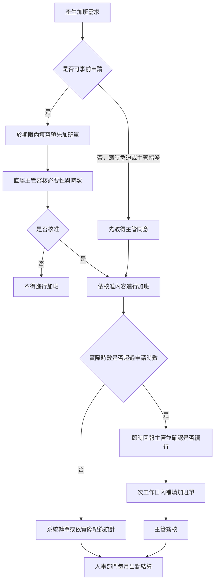

# 加班申請作業程序 (HR-PR-ATT-04)

## 文件資訊

| 欄位 | 內容 |
| --- | --- |
| 文件編號 | HR-PR-ATT-04 |
| 文件名稱 | 加班申請作業程序 |
| 文件類型 | 程序書 |
| 版本 | v0.2 |
| 狀態 | 已發行（現行執行） |
| 制定單位 | 人事課 |
| 制定者 | 蔡家瑋 |
| 審核者 |  |
| 核准者 |  |
| 生效日 |  |
| 最後更新日 | 2026-07-14 |

## 文件履歷

| 版本 | 日期 | 修訂內容 | 制定者 | 審核者 | 核准者 |
| --- | --- | --- | --- | --- | --- |
| v0.2 | 2026-07-14 | 調整加班申請方式為公司指定系統或行動 App，避免綁定特定系統名稱 | 蔡家瑋 |  |  |
| v0.1 |  | 初版草案建立 | 蔡家瑋 |  |  |

## 一、 目的

為規範員工加班之事前申請、主管審核、時數控管、補申請及人事統計作業，確保加班具必要性、急迫性及紀錄完整性，並維護薪資、補休與出勤結算之正確性，特訂定本程序。

## 二、 適用範圍

本程序適用於本公司全體員工因工作需要於正常工作時間以外、休息日或依法可申請加班之時段執行工作者。

一般交際應酬、通勤時間、公出或出差途中未實際提供勞務之時間，除經專案核准或符合公司工作規則所定延長工時要件外，不列入加班時數。

## 三、 權責

| 角色 | 權責 |
| --- | --- |
| 員工 | 依規定提出預先加班單或加班單，據實填寫原因、工作內容、時數與補休或加班費選擇；加班時數可能超出原申請時，應即時回報主管。 |
| 直屬主管 | 審核加班之必要性、急迫性、時數合理性及成果一致性；控管部門高工時與重複性加班原因。 |
| 人事部門 | 維護加班申請流程、檢核系統紀錄、統計每月實際加班時數，並提供薪資與補休結算依據。 |
| 部門主管 | 檢視可預期高峰需求，調整人力、工作分派或任務優先順序，降低非必要或集中性加班。 |

## 四、 加班申請流程圖

## 五、 加班類型與申請時限

| 加班類型 | 定義或適用情境 | 申請時限 | 申請方式 |
| --- | --- | --- | --- |
| 臨時性加班 | 原應於正常工時完成之任務，因合理原因延誤且具時間急迫性。 | 一般工作日於當日 15:00 前提出；休息日於前一個工作日 15:00 前提出。 | 於公司指定系統或行動 App 填寫預先加班單。 |
| 可預期加班 | 專案、活動、盤點、結帳、跨部門支援或其他可事先預估之需求。 | 原則上於加班日前一週提出預估需求。 | 於公司指定系統或行動 App 填寫預先加班單。 |
| 臨時急迫事項 | 因突發狀況無法事前完成系統申請，但確有加班必要。 | 應先取得主管同意，並於次工作日內補申請。 | 先口頭或通訊軟體取得主管同意，事後補填加班單。 |
| 主管臨時指派 | 加班係由主管臨時指派，且員工於加班結束後始能完成申請。 | 加班結束後依實際打卡時數填寫。 | 於公司指定系統或行動 App 填寫加班單。 |

## 六、 加班申請作業

### 1. 事前申請

1. 員工如有臨時性加班需求，應依下列時間提出：
   - 一般工作日：於當日 15:00 前提出。
   - 休息日：於前一個工作日 15:00 前提出。
2. 可預期之專案、活動、盤點、結帳或跨部門支援等加班需求，原則上應於加班日前一週提出預估需求。
3. 因臨時急迫事項無法事前完成系統申請者，應先取得主管同意，並於次工作日內完成補申請。
4. 員工應使用公司指定系統或行動 App 填寫「預先加班單」（現行為 104 App），並經直屬主管核准後，方可進行加班作業。

### 2. 遭臨時指派加班

1. 員工遭主管臨時指派加班者，應於加班結束後，使用公司指定系統或行動 App 填寫「加班單」。
2. 加班單應依實際打卡時數填寫，不得預估或浮報。

### 3. 申請內容

加班申請單內應確實填寫以下資訊：

1. 加班原因。臨時性加班應說明任務急迫性或延遲原因。
2. 預計時數，適用於預先加班單；或實際時數，適用於加班單。
3. 工作內容。
4. 工作類型，例如：
   - 日常業務處理。
   - 客戶急件或客訴處理。
   - 活動或專案支援。
   - 月底、季底或年度結帳。
   - 系統異常或緊急排除。
   - 盤點、稽核或法遵資料準備。
   - 跨部門支援。
   - 主管臨時指派。
5. 預計完成標的或交付成果。
6. 補休或加班費之選擇。

### 4. 核准與統計

主管完成線上審核後，人事部門將於每月出勤結算時，直接由系統轉單統計當月實際加班時數。

## 七、 主管審核與控管原則

主管審核加班申請時，應就必要性、急迫性、時數合理性及後續成本承接進行確認，避免非必要加班或重複性高工時情形。

### 1. 事前申請審核

1. 主管應確認加班是否屬必要、急迫，且確實無法於正常工時內完成。
2. 申請內容應明確載明工作類型、預估時數及預計完成標的；資訊不足時，主管得要求補充後再予審核。

### 2. 高峰需求預警

1. 主管應留意活動支援、月底結帳或其他可預期之工作高峰。
2. 如可預見加班需求，應優先評估人力支援、工作分派或任務優先順序調整，降低臨時性與集中性加班。

### 3. 時數合理性確認

1. 主管應參考同類任務過往加班時數，確認申請時數是否合理。
2. 申請時數超過常態區間時，員工應說明原因，主管確認後方可核准。

### 4. 事後檢核

1. 主管應確認加班成果與申請原因一致。
2. 人事部門與各部門主管應每月檢視高工時人員及重複加班原因，必要時提出工作分派或流程改善措施。

## 八、 加班時間超出申請時數之處理

### 1. 即時回報

若實際加班時間即將超過原申請時數，員工應立即通知直屬主管，並請示是否可繼續加班。

### 2. 補申請程序

1. 主管當下同意繼續加班者：
   - 員工應於次工作日內補填「加班申請單」。
   - 經主管簽核後，由人事部門進行系統時數修正。
2. 未即時回報而產生考勤異常者：
   - 薪資結算前，公司會通知員工核對異常出勤紀錄。
   - 若屬實際加班，仍須補填「加班申請單」並經主管簽核後，方可交由人事部門進行系統修正。

## 九、 注意事項

1. 嚴禁擅自加班：員工不得擅自超時加班；若有特殊工作狀況需延時，應立即回報主管。
2. 主管核准制：所有加班均應通過主管核准，以確保考勤紀錄與計薪之正確性。
3. 工作效率評估：若發現員工有多發性超時加班情形，且事前未做好適當評估與規劃，主管得要求員工提出工作改善計畫，以提高日常工作安排效率。
4. 系統紀錄為憑：加班費及補休計算，皆以流程中產生之系統文件為統計依據。如未依規定完成申請手續，系統將無法計入時數統計，請務必確實辦理，避免影響薪資計算與個人權益。
5. 主動確認：如對個人加班記錄有疑問，請於每月薪資發放前，主動與人事部門確認。

## 十、 紀錄保存

加班申請、主管核准、補申請、系統時數修正及每月出勤結算紀錄，應由系統或人事部門依公司文件保存規定留存，作為加班費、補休、出勤管理與內部稽核之依據。

## 十一、 相關文件

| 文件編號 | 文件名稱 |
| --- | --- |
| HR-MN-QM-01 | 員工管理手冊 |
| HR-PR-ATT-02 | 員工出勤管理程序 |
| HR-PR-ATT-03 | 業務人員出勤管理程序（已併入 HR-PR-ATT-02） |
| HR-WI-ATT-01 | 104企業大師手機打卡操作指南 |
