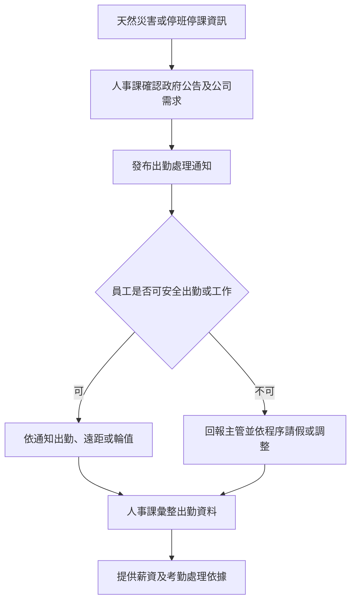

# 天然災害出勤及停班停課處理程序 (HR-PR-ATT-05)

## 文件資訊

| 欄位 | 內容 |
| --- | --- |
| 文件編號 | HR-PR-ATT-05 |
| 文件名稱 | 天然災害出勤及停班停課處理程序 |
| 文件類型 | 程序書 |
| 版本 | v0.1 |
| 狀態 | 草稿（未發行） |
| 制定單位 | 人事課 |
| 制定者 | 蔡家瑋 |
| 審核者 |  |
| 核准者 |  |
| 生效日 |  |
| 最後更新日 | 2026-07-07 |

## 文件履歷

| 版本 | 日期 | 修訂內容 | 制定者 | 審核者 | 核准者 |
| --- | --- | --- | --- | --- | --- |
| v0.1 | 2026-07-07 | 初版草案建立 | 蔡家瑋 |  |  |

## 一、目的

為規範颱風、地震、水災、豪雨或其他天然災害期間之出勤、停班停課、居家工作、請假及薪資處理原則，特制定本程序。

## 二、適用範圍

適用於公司全體員工於天然災害或政府宣布停班停課期間之出勤安排。

## 三、權責

| 角色 | 權責 |
| --- | --- |
| 人事課 | 彙整政府公告、發布公司出勤通知、確認出勤及請假處理原則。 |
| 各單位主管 | 評估業務必要性、員工安全及遠距或輪值安排。 |
| 員工 | 注意公司通知，回報所在地安全及是否可出勤或遠距工作。 |
| 財會課 | 依核定出勤及薪資處理原則辦理薪資計算。 |

## 四、作業流程

## 五、作業內容

### 5.1 公告依據

天然災害期間，原則上依員工工作地、居住地及實際通勤安全評估。政府停班停課公告為重要依據，但公司仍應考量員工安全及業務必要性。

### 5.2 公司通知

人事課應以公司指定管道通知出勤處理方式，內容包含適用地區、適用日期、出勤方式、遠距工作、輪值、請假及薪資處理原則。

### 5.3 員工安全回報

員工因災害、交通中斷、居住地危險或照顧家庭等原因無法出勤時，應儘速通知主管並依公司程序辦理。

### 5.4 薪資及出勤處理

天然災害期間之出勤、請假、加班或薪資計算，應依公司核定原則、員工管理手冊及相關法令辦理，並保留公告及出勤紀錄。

## 六、紀錄保存

| 紀錄 | 保存單位 | 保存方式 | 保存期間 |
| --- | --- | --- | --- |
| 公司出勤通知 | 人事課 | 公告或電子檔 | 依公司紀錄保存規定 |
| 員工回報及出勤資料 | 人事課 | 系統或電子檔 | 依公司紀錄保存規定 |
| 薪資處理依據 | 財會課 / 人事課 | 電子檔 | 依公司紀錄保存規定 |

## 七、相關文件

| 文件編號 | 文件名稱 |
| --- | --- |
| HR-MN-QM-01 | 員工管理手冊 |
| HR-SP-001 | 員工出勤管理規範 |
| HR-PR-ATT-01 | 員工請假管理程序 |
| HR-PR-PAY-02 | 薪資作業管理程序 |
