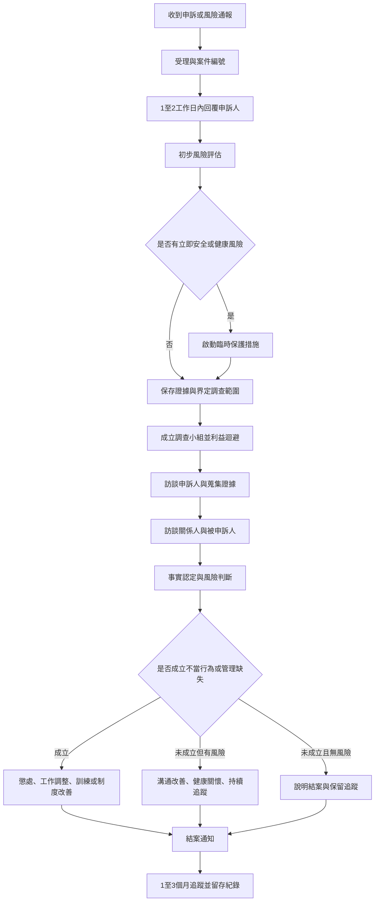

# 職場不法侵害申訴處理程序 (HR-PR-GEN-02)

## 一、目的
為預防及處理員工於執行職務時遭受主管、同事、客戶或其他人員之身體或精神不法侵害，建立受理、保護、調查、處置、改善及追蹤機制，並保存處理紀錄。

## 二、適用範圍
本程序適用於公司全體員工、派遣人員、實習生及其他受公司指揮監督從事工作之人員。

本程序包含但不限於職場霸凌、不當督導、威脅、羞辱、孤立、報復、工作資訊或個人資料不當揭露，以及因工作關係造成身心健康風險之事件。

## 三、法規與內部依據
1. 《勞動基準法》第 10-1 條：職務或工作地點調動應符合調動五原則。
2. 《職業安全衛生法》第 6 條第 2 項第 3 款：雇主應對執行職務因他人行為遭受身體或精神不法侵害之預防採取必要措施。
3. 《職業安全衛生設施規則》第 324-3 條：雇主應採取暴力預防措施，作成執行紀錄並留存三年。
4. 《個人資料保護法》第 20 條：非公務機關利用個人資料應在蒐集特定目的必要範圍內為之。
5. 《勞動契約》及公司工作規則、績效管理及獎懲程序。

註：職業安全衛生法於民國 114 年 12 月 19 日修正公布職場霸凌防治相關條文，官方資料標示施行日期未定；公司仍宜預先依其精神調整申訴管道、調查與懲處規範。

## 四、權責
| 角色 | 權責 |
| --- | --- |
| 申訴受理窗口 | 收件、編號、回覆受理、保密控管、啟動初步風險評估 |
| 人資單位 | 主導程序、保存紀錄、安排訪談、追蹤改善 |
| 調查小組 | 釐清事實、訪談關係人、檢視證據、提出調查結論與處理建議 |
| 高階主管 | 核定臨時保護措施、結案處置、工作調整或懲處 |
| 直屬主管 | 配合調查與改善；如為被申訴人，應利益迴避 |
| 當事人及關係人 | 誠實陳述、提供資料、遵守保密與禁止報復要求 |

## 五、處理流程圖

## 六、處理時限
| 階段 | 建議時限 | 重點工作 | 產出表單 |
| --- | --- | --- | --- |
| 受理 | 收件後 1 至 2 工作日 | 回覆已受理、指定非利害關係窗口、提醒保密與禁止報復 | HR-FM-GEN-05 |
| 初步風險阻斷 | 收件後 1 至 3 工作日 | 評估健康、安全、直屬關係、資料外流風險，必要時調整回報線或溝通方式 | HR-FM-GEN-05 |
| 調查啟動 | 收件後 3 至 7 工作日 | 成立調查小組、界定調查範圍、保存證據 | HR-FM-GEN-06 |
| 事實調查 | 原則 14 工作日內 | 訪談申訴人、被申訴人、證人，調閱文件與紀錄 | HR-FM-GEN-06、HR-FM-GEN-07、HR-FM-GEN-08 |
| 結論與處置 | 原則 21 工作日內 | 完成調查報告、核定處置、告知雙方 | HR-FM-GEN-09、必要時 HR-FM-PER-02 |
| 追蹤改善 | 結案後 1 至 3 個月 | 確認無報復、二次傷害或工作障礙，檢視改善措施有效性 | HR-FM-GEN-09 |

必要時得延長調查期間，但應記載延長理由並通知申訴人。

## 七、受理與保密原則
1. 接獲書面、口頭、電子郵件或通訊軟體申訴，均應受理並轉成案件紀錄。
2. 案件資料採最小知悉原則，僅限受理窗口、調查小組、核決主管及必要協助人員查閱。
3. 若申訴內容包含健康、就醫、用藥或家庭資訊，不得要求員工提供完整病歷；僅得於必要範圍內請員工自願提供診斷證明、醫囑或工作調整建議。
4. 公司不得因員工申訴、協助調查或提供證據而給予不利待遇。

## 八、臨時保護措施
調查期間可採下列非懲戒性措施，並應明確記載為臨時安排，不代表公司已認定任一方有錯：

1. 暫時調整工作回報線或直屬管理窗口。
2. 暫停被申訴主管與申訴人單獨面談。
3. 必要溝通改採書面、會議紀錄或第三人在場。
4. 暫時調整費用審核、考核或排班權限。
5. 明確化客戶交接、業務區域、績效目標及工作分工。
6. 提供 EAP、外部諮詢、休假或工作負荷調整資訊。

## 九、調查範圍設定
調查小組應將申訴拆解為可查證事項，例如：

1. 職務或區域調動是否符合勞基法第 10-1 條調動五原則。
2. 主管言語、管理方式或績效要求是否逾越業務必要與合理範圍。
3. 是否有散布、孤立、威脅、羞辱、報復或不當標籤化。
4. 費用申報、客戶、業績或健康資訊是否遭無權限揭露。
5. 現行直屬關係是否已造成健康、安全、工作執行或管理風險。

## 十、調查方法
1. 優先訪談申訴人，請其具體說明時間、地點、人物、原話、證據、證人及請求事項。
2. 訪談關係人與證人，確認其親自見聞範圍，避免臆測。
3. 訪談被申訴人，給予完整陳述與答辯機會。
4. 調閱相關文件，例如會議紀錄、調區公告、業績資料、費用核銷紀錄、LINE、Email、簽核紀錄。
5. 如涉及個資、職安或高衝突勞資爭議，得請外部律師、職安顧問或勞資顧問協助。

## 十一、合理管理與不當督導判斷基準
| 判斷點 | 合理管理 | 高風險不當督導 |
| --- | --- | --- |
| 目的 | 修正錯誤、達成業務目標、維持紀律 | 羞辱、孤立、報復、迫使離職 |
| 內容 | 具體指出事實、標準與改善方式 | 人格貶抑、威脅、嘲諷、暗示不適任 |
| 場合 | 私下或必要管理會議 | 在無關人員前公開羞辱或散布 |
| 頻率 | 偶發且有客觀管理需求 | 反覆、持續、針對特定人 |
| 手段 | 有標準、有紀錄、可追蹤 | 無標準、選擇性執法、資訊不當揭露 |
| 影響 | 促成工作改善 | 造成身心壓力、排擠、工作障礙 |

## 十二、結案處置
調查完成後，應依事實與風險程度採取一項或多項措施：

1. 查無不當但有溝通風險：書面提醒、管理溝通訓練、追蹤面談。
2. 有不當督導但未達重大懲戒：書面警告、申誡、暫停特定管理權限、調整考核或費用審核流程。
3. 確認反覆羞辱、威脅、報復、資料不當揭露或違法調動：依 HR-FM-PER-02 啟動獎懲程序，並調整組織歸屬、業務區域或管理權限。
4. 調動不符合法定或契約要求：撤回、修正、給予過渡期、調整業績目標或補助。
5. 涉及個資或內控缺失：限制資料流通、重新設定權限、教育訓練、必要時通報管理階層。

## 十三、紀錄保存
本程序所生之申訴資料、初步評估、訪談紀錄、調查報告、處置紀錄與追蹤紀錄，應由人資單位保存至少三年；如進入勞資爭議、訴訟、職災或個資事件處理，應保存至爭議終結後再依公司文件保存規定辦理。

