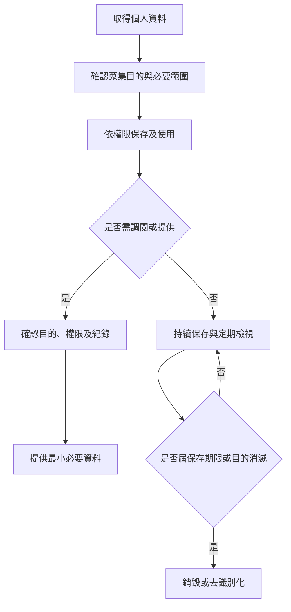

# 個人資料保護管理程序 (HR-PR-GEN-03)

## 文件資訊

| 欄位 | 內容 |
| --- | --- |
| 文件編號 | HR-PR-GEN-03 |
| 文件名稱 | 個人資料保護管理程序 |
| 文件類型 | 程序書 |
| 版本 | v0.1 |
| 狀態 | 草稿（未發行） |
| 制定單位 | 人事課 |
| 制定者 | 蔡家瑋 |
| 審核者 |  |
| 核准者 |  |
| 生效日 |  |
| 最後更新日 | 2026-07-07 |

## 文件履歷

| 版本 | 日期 | 修訂內容 | 制定者 | 審核者 | 核准者 |
| --- | --- | --- | --- | --- | --- |
| v0.1 | 2026-07-07 | 初版草案建立 | 蔡家瑋 |  |  |

## 一、目的

為保護員工、求職者及離職人員之個人資料，明確資料蒐集、使用、保存、權限控管及事件通報原則，特制定本程序。

## 二、適用範圍

適用於招募、任用、薪資、出勤、考核、訓練、保險、福利、離職及其他人事管理作業中所取得或保存之個人資料。

## 三、權責

| 角色 | 權責 |
| --- | --- |
| 人事課 | 管理人事資料蒐集、保存、使用、調閱及銷毀作業。 |
| 主管 | 僅於業務必要範圍內使用員工資料，並負保密責任。 |
| 資訊或系統管理單位 | 維護系統權限、備份、存取紀錄及資安措施。 |
| 員工 | 提供正確資料，並於資料異動時主動通知人事課。 |

## 四、作業流程

## 五、作業內容

### 5.1 蒐集及使用

個人資料之蒐集應以人事管理必要範圍為限，並應避免蒐集與目的無關之資料。資料使用應限於招募、任用、薪資、保險、福利、出勤、考核、訓練及法令要求事項。

### 5.2 權限控管

人事資料應依職務需要授權存取。非經業務必要或主管核准，不得任意調閱、下載、複製、轉寄或提供他人使用。

### 5.3 第三方提供

因薪資、保險、健檢、教育訓練或法令要求需提供資料予第三方時，應確認提供目的、範圍、對象及資料安全要求。

### 5.4 資料異常或揭露事件

如發生資料誤寄、遺失、未授權存取或疑似外洩，發現人應立即通知人事課及相關單位，並依檢核表記錄事件、影響範圍、改善措施及結案結果。

## 六、紀錄保存

| 紀錄 | 保存單位 | 保存方式 | 保存期間 |
| --- | --- | --- | --- |
| 人事資料 | 人事課 | 紙本 / 系統 / 雲端權限資料夾 | 依公司紀錄保存規定 |
| 調閱或提供紀錄 | 人事課 | 系統紀錄或申請紀錄 | 依公司紀錄保存規定 |
| 資料揭露事件紀錄 | 人事課 | 表單及改善紀錄 | 依公司紀錄保存規定 |

## 七、相關文件

| 文件編號 | 文件名稱 |
| --- | --- |
| HR-PR-REC-02 | 勞動契約與人事資料管理程序 |
| HR-FM-GEN-08 | 個人資料揭露事件檢核與改善紀錄表 |
