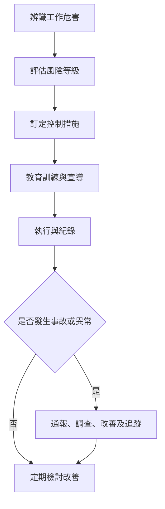

# 職業安全衛生管理程序 (HR-PR-GEN-04)

## 文件資訊

| 欄位 | 內容 |
| --- | --- |
| 文件編號 | HR-PR-GEN-04 |
| 文件名稱 | 職業安全衛生管理程序 |
| 文件類型 | 程序書 |
| 版本 | v0.1 |
| 狀態 | 草稿（未發行） |
| 制定單位 | 人事課 |
| 制定者 | 蔡家瑋 |
| 審核者 |  |
| 核准者 |  |
| 生效日 |  |
| 最後更新日 | 2026-07-07 |

## 文件履歷

| 版本 | 日期 | 修訂內容 | 制定者 | 審核者 | 核准者 |
| --- | --- | --- | --- | --- | --- |
| v0.1 | 2026-07-07 | 初版草案建立 | 蔡家瑋 |  |  |

## 一、目的

為建立安全健康之工作環境，降低職業災害、職場不法侵害及健康危害風險，特制定本程序。

## 二、適用範圍

適用於公司工作場所、外勤工作、倉儲作業、客戶現場作業及其他受公司指揮監督之工作活動。

## 三、權責

| 角色 | 權責 |
| --- | --- |
| 公司負責人或授權主管 | 提供必要資源並核定安全衛生改善事項。 |
| 人事課 | 協助制度維護、教育訓練、健康保護及申訴處理銜接。 |
| 各單位主管 | 辨識工作風險、落實安全衛生要求及事故通報。 |
| 員工 | 遵守安全衛生規定，回報危害、事故或近失事件。 |

## 四、作業流程

## 五、作業內容

### 5.1 危害辨識

各單位應就工作環境、設備、搬運、交通、外勤、化學品、長時間工作、職場暴力、心理壓力及其他可能危害進行辨識。

### 5.2 控制措施

風險控制應優先採取消除、替代、工程改善、管理控制及個人防護等措施。必要時應建立教育訓練、警示標示、作業檢核或主管巡查機制。

### 5.3 事故通報與調查

發生職業災害、近失事件、工作場所暴力、重大安全異常或健康危害疑慮時，員工或主管應立即通報，並進行原因分析、改善及追蹤。

### 5.4 健康保護

公司應依工作特性安排必要之健康保護措施，例如健康檢查、母性健康保護、長時間工作風險評估、職場不法侵害預防及健康諮詢。

## 六、紀錄保存

| 紀錄 | 保存單位 | 保存方式 | 保存期間 |
| --- | --- | --- | --- |
| 安全衛生教育訓練紀錄 | 人事課 / 各單位 | 表單或系統 | 依公司紀錄保存規定 |
| 事故通報及改善紀錄 | 人事課 / 權責單位 | 表單或報告 | 依公司紀錄保存規定 |
| 風險評估及改善追蹤 | 權責單位 | 檢核表或報告 | 依公司紀錄保存規定 |

## 七、相關文件

| 文件編號 | 文件名稱 |
| --- | --- |
| HR-PR-GEN-02 | 職場不法侵害申訴處理程序 |
| HR-PR-GEN-05 | 員工申訴與意見反映管理程序 |
