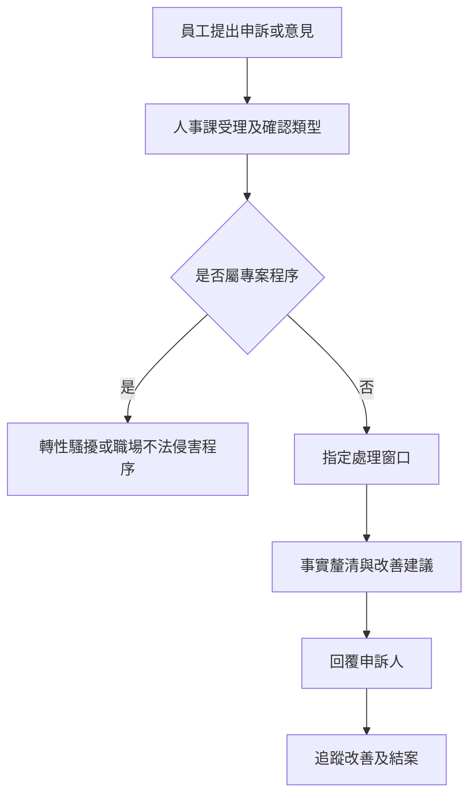

# 員工申訴與意見反映管理程序 (HR-PR-GEN-05)

## 文件資訊

| 欄位 | 內容 |
| --- | --- |
| 文件編號 | HR-PR-GEN-05 |
| 文件名稱 | 員工申訴與意見反映管理程序 |
| 文件類型 | 程序書 |
| 版本 | v0.1 |
| 狀態 | 草稿（未發行） |
| 制定單位 | 人事課 |
| 制定者 | 蔡家瑋 |
| 審核者 |  |
| 核准者 |  |
| 生效日 |  |
| 最後更新日 | 2026-07-07 |

## 文件履歷

| 版本 | 日期 | 修訂內容 | 制定者 | 審核者 | 核准者 |
| --- | --- | --- | --- | --- | --- |
| v0.1 | 2026-07-07 | 初版草案建立 | 蔡家瑋 |  |  |

## 一、目的

為提供員工反映制度、工作安排、人際互動、管理作法或其他職場問題之正式管道，並確保申訴處理公正、保密且禁止不利對待，特制定本程序。

## 二、適用範圍

適用於一般申訴、意見反映、制度建議及非屬性騷擾或職場不法侵害專案程序之職場問題。涉及性騷擾或職場不法侵害者，應依專屬程序辦理。

## 三、權責

| 角色 | 權責 |
| --- | --- |
| 申訴人 | 提出事實、時間、對象、訴求及相關資料。 |
| 人事課 | 受理、分案、保密、追蹤處理進度及保存紀錄。 |
| 受理主管 | 協助釐清事實、提出改善措施及回覆處理結果。 |
| 核准主管 | 就重大或跨部門案件核定處理方式。 |

## 四、作業流程

## 五、作業內容

### 5.1 受理方式

員工得以書面、電子郵件、面談或公司指定管道提出申訴或意見。匿名反映得視資料完整性進行初步了解。

### 5.2 保密與禁止不利對待

處理過程應保護申訴人、被申訴人及相關人員隱私。不得因員工提出申訴、協助調查或提供資料而予以不利對待。

### 5.3 處理與回覆

人事課應依案件性質指定處理窗口，必要時邀集相關主管討論改善措施。處理結果應以適當方式回覆申訴人。

### 5.4 結案追蹤

涉及制度調整、主管管理、工作分派或環境改善者，應設定追蹤期限並確認改善效果。

## 六、紀錄保存

| 紀錄 | 保存單位 | 保存方式 | 保存期間 |
| --- | --- | --- | --- |
| 申訴或意見紀錄 | 人事課 | 書面或電子檔 | 依公司紀錄保存規定 |
| 處理及回覆紀錄 | 人事課 | 書面或電子檔 | 依公司紀錄保存規定 |
| 改善追蹤紀錄 | 人事課 / 權責單位 | 表單或會議紀錄 | 依公司紀錄保存規定 |

## 七、相關文件

| 文件編號 | 文件名稱 |
| --- | --- |
| HR-PR-GEN-01 | 性騷擾防治與申訴程序 |
| HR-PR-GEN-02 | 職場不法侵害申訴處理程序 |
