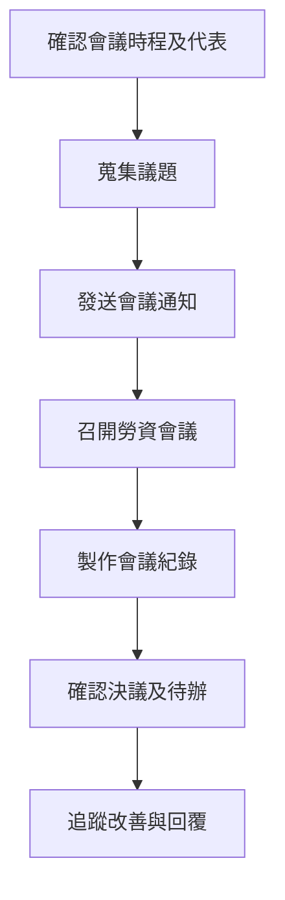

# 勞資會議管理程序 (HR-PR-GEN-06)

## 文件資訊

| 欄位 | 內容 |
| --- | --- |
| 文件編號 | HR-PR-GEN-06 |
| 文件名稱 | 勞資會議管理程序 |
| 文件類型 | 程序書 |
| 版本 | v0.1 |
| 狀態 | 草稿（未發行） |
| 制定單位 | 人事課 |
| 制定者 | 蔡家瑋 |
| 審核者 |  |
| 核准者 |  |
| 生效日 |  |
| 最後更新日 | 2026-07-07 |

## 文件履歷

| 版本 | 日期 | 修訂內容 | 制定者 | 審核者 | 核准者 |
| --- | --- | --- | --- | --- | --- |
| v0.1 | 2026-07-07 | 初版草案建立 | 蔡家瑋 |  |  |

## 一、目的

為建立公司與員工間制度溝通、勞動條件協商及意見交流之正式機制，並保存勞資會議紀錄，特制定本程序。

## 二、適用範圍

適用於公司勞資會議之代表產生、會議召開、議題彙整、紀錄確認及決議追蹤。

## 三、權責

| 角色 | 權責 |
| --- | --- |
| 人事課 | 規劃會議時程、彙整議題、製作紀錄及追蹤決議。 |
| 資方代表 | 代表公司出席會議，說明制度、營運及管理事項。 |
| 勞方代表 | 代表員工提出意見、建議及需協商事項。 |
| 相關單位主管 | 就議題提供資料、改善方案或執行回覆。 |

## 四、作業流程

## 五、作業內容

### 5.1 代表及會議安排

人事課應依公司實際需求及法令要求安排勞資會議代表、會議週期及會議通知。代表名單及異動應留存紀錄。

### 5.2 議題彙整

議題可包含工作規則、出勤、薪資福利、教育訓練、安全衛生、員工意見及其他與勞動條件相關事項。

### 5.3 會議紀錄與追蹤

會議紀錄應載明出席情形、討論事項、決議及待辦。涉及制度調整或改善事項者，應指定權責單位及追蹤期限。

## 六、紀錄保存

| 紀錄 | 保存單位 | 保存方式 | 保存期間 |
| --- | --- | --- | --- |
| 勞資會議簽到表 | 人事課 | 紙本或電子檔 | 依公司紀錄保存規定 |
| 勞資會議紀錄 | 人事課 | 紙本或電子檔 | 依公司紀錄保存規定 |
| 決議追蹤紀錄 | 人事課 / 權責單位 | 電子檔或會議紀錄 | 依公司紀錄保存規定 |

## 七、相關文件

| 文件編號 | 文件名稱 |
| --- | --- |
| HR-FM-GEN-02 | 勞資會議紀錄 |
| HR-FM-GEN-03 | 勞資會議簽到表 |
