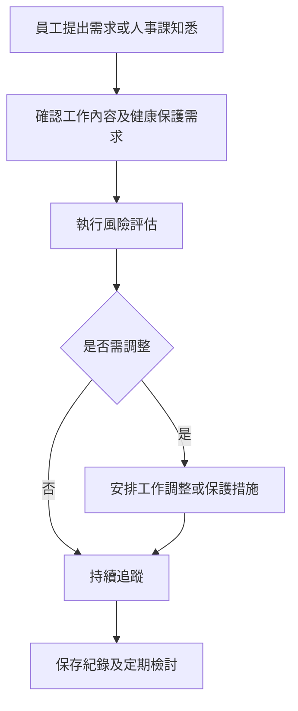

# 母性健康保護管理程序 (HR-PR-GEN-07)

## 文件資訊

| 欄位 | 內容 |
| --- | --- |
| 文件編號 | HR-PR-GEN-07 |
| 文件名稱 | 母性健康保護管理程序 |
| 文件類型 | 程序書 |
| 版本 | v0.1 |
| 狀態 | 草稿（未發行） |
| 制定單位 | 人事課 |
| 制定者 | 蔡家瑋 |
| 審核者 |  |
| 核准者 |  |
| 生效日 |  |
| 最後更新日 | 2026-07-07 |

## 文件履歷

| 版本 | 日期 | 修訂內容 | 制定者 | 審核者 | 核准者 |
| --- | --- | --- | --- | --- | --- |
| v0.1 | 2026-07-07 | 初版草案建立 | 蔡家瑋 |  |  |

## 一、目的

為保護妊娠、分娩後及哺乳期間員工之健康與工作安全，建立通報、風險評估、工作調整及追蹤機制，特制定本程序。

## 二、適用範圍

適用於公司妊娠中、分娩後一年內、哺乳中或有母性健康保護需求之員工。

## 三、權責

| 角色 | 權責 |
| --- | --- |
| 員工 | 視個人需求主動通知人事課或主管，並提供必要資料以利保護措施安排。 |
| 人事課 | 受理需求、協調工作調整、請假及健康保護措施。 |
| 直屬主管 | 評估工作安排，配合調整工時、地點、負荷或危害暴露。 |
| 職安衛或健康服務資源 | 協助風險評估、健康諮詢及改善建議。 |

## 四、作業流程

## 五、作業內容

### 5.1 通報與保密

員工得依需求向人事課或主管提出母性健康保護需求。相關健康及個人資料應保密，僅供必要之保護措施安排使用。

### 5.2 風險評估

應評估工作時間、搬運負荷、化學品、外勤交通、久站久坐、夜間工作、壓力及其他可能影響健康之因素。

### 5.3 工作調整

必要時得採取工時調整、工作內容調整、避免危害暴露、安排休息或其他合理保護措施。請假事項依員工請假管理程序辦理。

## 六、紀錄保存

| 紀錄 | 保存單位 | 保存方式 | 保存期間 |
| --- | --- | --- | --- |
| 母性健康保護需求紀錄 | 人事課 | 機密電子檔或紙本 | 依公司紀錄保存規定 |
| 風險評估及調整紀錄 | 人事課 / 權責單位 | 機密電子檔或紙本 | 依公司紀錄保存規定 |

## 七、相關文件

| 文件編號 | 文件名稱 |
| --- | --- |
| HR-PR-GEN-04 | 職業安全衛生管理程序 |
| HR-PR-ATT-01 | 員工請假管理程序 |
| HR-FM-ATT-01 | 員工假別說明表 |
