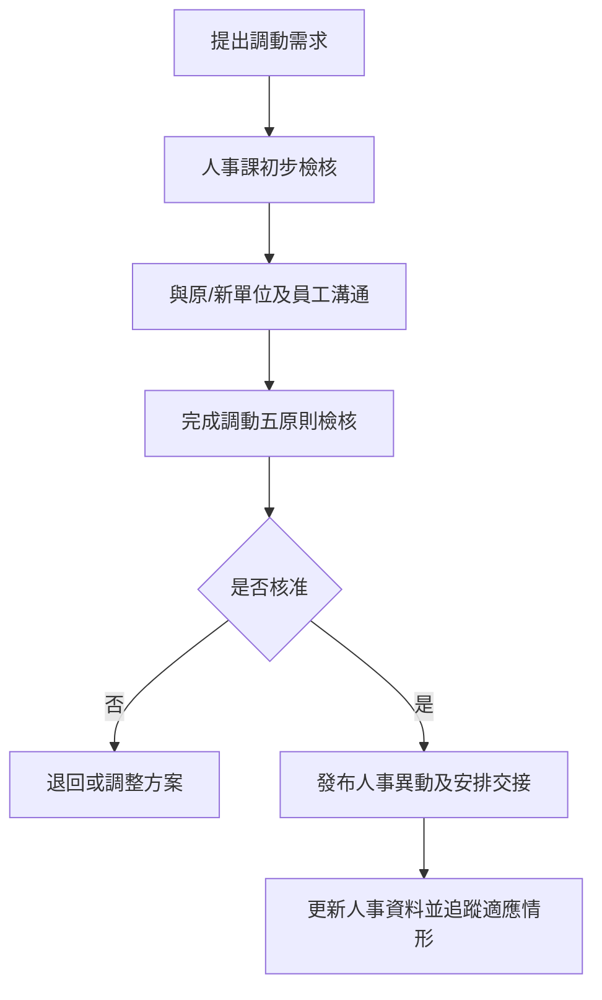

# 職務調動管理程序 (HR-PR-GEN-08)

## 文件資訊

| 欄位 | 內容 |
| --- | --- |
| 文件編號 | HR-PR-GEN-08 |
| 文件名稱 | 職務調動管理程序 |
| 文件類型 | 程序書 |
| 版本 | v0.1 |
| 狀態 | 草稿（未發行） |
| 制定單位 | 人事課 |
| 制定者 | 蔡家瑋 |
| 審核者 |  |
| 核准者 |  |
| 生效日 |  |
| 最後更新日 | 2026-07-07 |

## 文件履歷

| 版本 | 日期 | 修訂內容 | 制定者 | 審核者 | 核准者 |
| --- | --- | --- | --- | --- | --- |
| v0.1 | 2026-07-07 | 初版草案建立 | 蔡家瑋 |  |  |

## 一、目的

為規範公司因組織調整、職務需求、員工發展或營運需要所為之職務調動，並確保調動合理、溝通明確且紀錄完整，特制定本程序。

## 二、適用範圍

適用於員工之部門、職務、工作地點、主管、薪資條件或工作內容有重大變更之調動作業。

## 三、權責

| 角色 | 權責 |
| --- | --- |
| 需求單位主管 | 提出調動需求、說明原因及新職務條件。 |
| 原單位主管 | 確認交接安排及原職務影響。 |
| 人事課 | 檢核調動合理性、協助溝通、維護人事異動紀錄。 |
| 員工 | 參與調動溝通，提出疑義或需協助事項。 |
| 核准主管 | 核定調動案及必要之配套措施。 |

## 四、作業流程

## 五、作業內容

### 5.1 調動評估

調動前應評估業務必要性、員工能力、工作地點、薪資條件、家庭生活影響、交通及健康安全等因素。

### 5.2 溝通與檢核

人事課應協助主管與員工溝通調動原因、職務內容、生效日、薪資福利及交接安排，並完成職務調動五原則檢核。

### 5.3 異動發布與追蹤

調動核准後，應更新人事資料、系統權限及組織資訊。調動後得視需要追蹤員工適應狀況及主管回饋。

## 六、紀錄保存

| 紀錄 | 保存單位 | 保存方式 | 保存期間 |
| --- | --- | --- | --- |
| 調動申請或核准紀錄 | 人事課 | 電子檔或簽核紀錄 | 依公司紀錄保存規定 |
| 職務調動五原則檢核表 | 人事課 | 電子檔或紙本 | 依公司紀錄保存規定 |
| 人事異動紀錄 | 人事課 | 系統或電子檔 | 依公司紀錄保存規定 |

## 七、相關文件

| 文件編號 | 文件名稱 |
| --- | --- |
| HR-MN-QM-01 | 員工管理手冊 |
| HR-FM-GEN-07 | 職務調動五原則檢核表 |
| HR-PR-REC-02 | 勞動契約與人事資料管理程序 |
