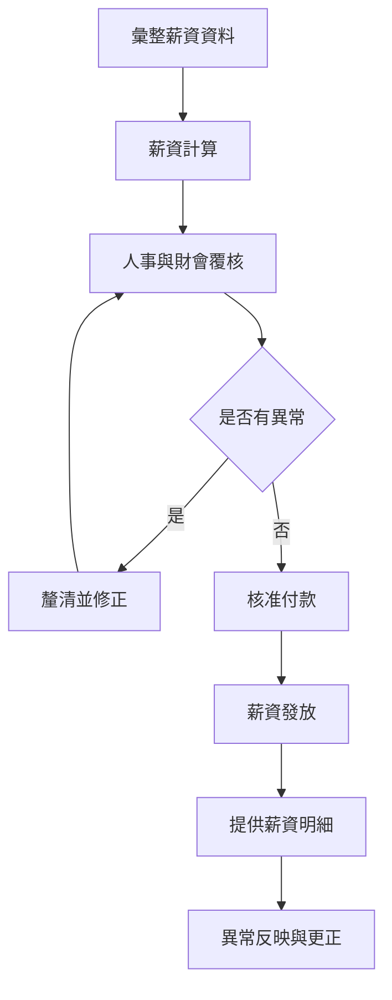

# 薪資作業管理程序 (HR-PR-PAY-02)

## 文件資訊

| 欄位 | 內容 |
| --- | --- |
| 文件編號 | HR-PR-PAY-02 |
| 文件名稱 | 薪資作業管理程序 |
| 文件類型 | 程序書 |
| 版本 | v0.1 |
| 狀態 | 草稿（未發行） |
| 制定單位 | 人事課 |
| 制定者 | 蔡家瑋 |
| 審核者 |  |
| 核准者 |  |
| 生效日 |  |
| 最後更新日 | 2026-07-07 |

## 文件履歷

| 版本 | 日期 | 修訂內容 | 制定者 | 審核者 | 核准者 |
| --- | --- | --- | --- | --- | --- |
| v0.1 | 2026-07-07 | 初版草案建立 | 蔡家瑋 |  |  |

## 一、目的

為規範薪資資料彙整、計算、覆核、發放、薪資明細提供及異常更正流程，確保薪資作業正確、準時且可追溯，特制定本程序。

## 二、適用範圍

適用於公司員工薪資、加班費、津貼、加給、獎金、扣款、保險、退休金提繳及薪資相關資料處理。

## 三、權責

| 角色 | 權責 |
| --- | --- |
| 人事課 | 提供人事異動、出勤、請假、加班、獎懲及薪資異動資料。 |
| 財會課 | 執行薪資計算、覆核、付款及會計入帳。 |
| 各單位主管 | 確認所屬員工出勤、加班、獎金或扣款資料。 |
| 員工 | 確認薪資明細，如有疑義應於期限內提出。 |

## 四、作業流程

## 五、作業內容

### 5.1 薪資資料彙整

薪資計算前應彙整任用、離職、留職停薪、薪資異動、出勤、請假、加班、津貼、加給、獎金、扣款及保險等資料。

### 5.2 覆核及核准

薪資計算完成後，應由人事課及財會課依權責覆核。涉及例外給付、重大調整或補發扣回者，應取得適當核准。

### 5.3 發放及明細

薪資應依公司規定日期發放。員工得查閱薪資明細，內容應包含薪資項目、加項、扣項及實發金額。

### 5.4 異常更正

員工發現薪資疑義時，應向人事課或財會課反映。經確認需更正者，應於當期或次期薪資辦理補發、扣回或調整。

## 六、紀錄保存

| 紀錄 | 保存單位 | 保存方式 | 保存期間 |
| --- | --- | --- | --- |
| 薪資計算資料 | 財會課 / 人事課 | 系統或電子檔 | 依公司紀錄保存規定 |
| 薪資覆核紀錄 | 財會課 | 電子檔或簽核紀錄 | 依公司紀錄保存規定 |
| 薪資異常更正紀錄 | 財會課 / 人事課 | 電子檔或簽核紀錄 | 依公司紀錄保存規定 |

## 七、相關文件

| 文件編號 | 文件名稱 |
| --- | --- |
| HR-MN-QM-01 | 員工管理手冊 |
| HR-PR-PAY-01 | 津貼加給及獎金發放程序 |
| HR-SP-001 | 員工出勤管理規範 |
