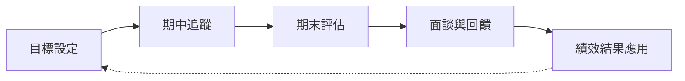

# 績效管理及獎懲程序 (HR-PR-PER-01)

## 文件資訊

| 欄位 | 內容 |
| --- | --- |
| 文件編號 | HR-PR-PER-01 |
| 文件名稱 | 績效管理及獎懲程序 |
| 文件類型 | 程序書 |
| 版本 | v1.0 |
| 狀態 | 已發行（來源SOP） |
| 制定單位 | 人事課 |
| 制定者 | 蔡家瑋 |
| 審核者 |  |
| 核准者 |  |
| 生效日 | 2025/1/1 |
| 最後更新日 | 2026-07-06 |

## 文件履歷

| 版本 | 日期 | 修訂內容 | 制定者 | 審核者 | 核准者 |
| --- | --- | --- | --- | --- | --- |
| v0.1 |  | 初版草案建立 | 蔡家瑋 |  |  |

## 一、 目的

本辦法旨在通過對員工的工作表現、工作態度、出勤率及客戶滿意度進行全面的評估，確保公司能夠充分發揮人力資源潛力，提升整體績效，並促進員工個人發展。

## 二、 適用範圍

本辦法適用公司所有在職員工。

### 考核流程圖

本公司考核類型包含：試用期考核、半年度考核、年度考核、績效改善計畫（PIP）。

### 1. 試用期考核
對新進人員到職 3 個月內之工作表現進行適任評估，由直屬主管進行。如合格可予以任職或調動，如不合格則予以資遣或延長考核期最多至 6 個月。

### 2. 半年度考核
各部門主管對所屬人員之工作表現、專長、特性等應詳細考核及記錄，以便適時施以訓練輔導，每隔半年定期考核一次，藉以發掘其才能即適任傾向做為訓練培養及職務調整派任之依據。

#### 考核流程
1. **目標設定**：每個評估周期的開始，前半年的目標設定期間為 12月-1月間、後半年為 6-7月間，員工需與直屬主管面談並一起設定具體的工作目標。
2. **考核回顧**：主管可視各員工狀況在評估周期中期（3-4月及9-10月），安排進行一次中期回顧面談，以確保目標進展順利並能夠提早發現問題做及時的調整。
3. **期末評估**：每個評估周期（7月、1月）結束後，主管將對員工的表現進行綜合評估，並給予具體分數。
4. **回饋與溝通**：評估完成後，主管將與員工進行面談，提供具體回饋，並討論下一次考核的目標及發展計畫。

#### 考核項目與評分標準
**工作表現（總計 80分）**
- **目標達成及工作品質（佔 70分）**：評估員工在評估期內是否達成設定的工作目標、及工作品質是否符合公司標準。
  - **業務部門**：業績達成率 (35分)、業績額度 (20分)、業務開發積極度 (10分)、業務活動辦理品質 (5分)。主管加分項：領導能力/團隊表現 (5分)。
  - **內勤部門（含倉儲）**：作業準確度 (20分)、作業於正常工作時間完成 (10分)、工作目標達成 (40分)。主管加分項：領導能力/團隊表現 (5分)。
- **問題解決能力（佔 10分）**：評估員工在面對工作中的挑戰時，能否迅速、有效地解決問題。

**工作態度（總計 20分）**
- **團隊合作與協作（佔 10分）**：評估員工在團隊中的合作精神。
- **職業發展與學習（佔 5分）**：評估員工在職業發展方面的積極性，主動參與培訓與學習。
- **員工敬業度（佔 5分）**：評估員工是否展現出對公司文化和價值觀的認同和實踐。

**整體表現額外加減分項**
- **內外部客戶回饋**：按次計，依客戶回饋正負面給予 +0.5 ~ -0.5 分。
- **創新**：半年度評估，依創新提案執行成效給予 0 ~ 3 分。
- **主動性**：半年度評估，依主動參與跨部門專案之貢獻給予 0 ~ 3 分。
- **專案成效**：依案數計分 (最高 10 分)，依專案評分 × 專案重要度係數 × 個人貢獻度係數計算 (-5 ~ 5 分)。

### 3. 年度考核
上、下半年度考核之平均分數，即為年度考核參照。平均分數依獎懲條目加減分後，進行五等次評分：
1. **特等**：服務成績優異卓越，有具體事實，成績在 90分以上者。
2. **優等**：服務成績超過要求標準，成績在 80-89者。
3. **甲等**：服務成績合乎要求，達到標準，成績在 70-79者。
4. **乙等**：服務成績雖未達標準，努力改善即可達到，成績在 60-69者。
5. **丙等**：服務成績未達標準，整體成績落後，較難改善者，成績未滿 60者。

評分結果將影響年終獎金之發放係數。

### 4. 績效改善計畫考核 (PIP)
績效改善計畫（Performance Improvement Plan, PIP）係為協助員工改善未達標準之工作表現，使其有合理機會回復至職務要求與勞動契約預期之工作水準。PIP 應以輔導、改善及合理協助為目的，並作為公司評估員工是否仍能勝任原職務之程序依據。

#### 4.1 啟動條件
有下列情形之一者，主管得會同人資單位評估是否啟動 PIP：
1. 年度或半年度考核分數為丙等者。
2. 連續兩次考核為乙等，且具體工作表現仍未達職務要求者。
3. 雖未達前二款情形，但有具體事實顯示員工於工作品質、目標達成、作業效率、客戶服務、團隊協作或主管合理指示執行上，持續未達職務要求者。

啟動 PIP 前，主管應提出具體事證及評估資料，不得僅以抽象評語作為依據。主管及人資單位並應先檢視未達標準之原因，是否涉及目標設定不明、資源不足、教育訓練不足、工作分派或職務配置不當等因素。

#### 4.2 執行原則
PIP 之訂定及執行應遵守下列原則：
1. 符合法令、勞動契約、工作規則及本程序之規定，並以勞動基準法及相關法令為最低標準。
2. 符合比例原則，不得要求員工負擔與職務、薪資、資源或客觀能力顯不相當之改善目標。
3. 改善事項應具體、明確、可衡量或可觀察，避免僅使用「態度不佳」、「不夠積極」、「主觀性強」等籠統描述。
4. 改善目標應具可行性，改善期間應足以使員工在客觀上有合理機會完成改善。
5. PIP 要求不得違反法律強制規定或公司規章，例如不得要求違法招攬業務、未依法申請之加班或其他違法行為。
6. 公司應依 PIP 內容提供必要之輔導、訓練、資源或工作指導。
7. PIP 執行時應嚴格遵守既定程序，評估及會議紀錄不得流於形式。
8. PIP 期末判斷員工能否勝任工作時，應以 PIP 所列改善項目及期間內具體紀錄為主要判斷依據，不得於期末任意追加未列入 PIP 之新項目作為未通過理由。

#### 4.3 PIP 計畫內容
啟動 PIP 時，主管應會同人資單位與員工召開啟動會議，並以書面載明下列事項：
1. PIP 啟動原因及具體未達標準事實。
2. 對應之職務要求、考核項目、公司規定或主管合理指示。
3. 改善目標、衡量標準及完成期限。
4. 公司將提供之協助，例如主管定期輔導、資深主管或同事指導、教育訓練、工作資源、作業流程說明、優先順序調整或必要工具。
5. 追蹤會議之頻率、預定日期、參與人員及紀錄方式。
6. 員工可提出之意見、所需協助或對目標可行性之說明。
7. PIP 可能結果及後續處理方式。

PIP 原則上為期三個月。因職務特性、改善項目性質、訓練週期或客觀上需較長期間始能驗證改善成效者，得延長至六個月。PIP 期間不得短於客觀上可合理達成改善之時間。

#### 4.4 輔導與資源協助
PIP 期間，公司應視改善項目提供必要協助，以促進員工改善工作表現。可採取之措施包括：
1. 由直屬主管或指定輔導人進行工作指導。
2. 安排績效較佳之主管、資深同仁或相關專業人員協助示範與回饋。
3. 提供必要教育訓練、作業標準、產品知識、系統操作、客戶服務或管理技巧訓練。
4. 明確調整工作優先順序、交付期限、工作量或資源配置。
5. 對於因職務配置不當、工作內容與員工能力特性不符所致之績效問題，評估是否調整工作內容或安排適當職務。

前項協助應於 PIP 計畫或追蹤會議紀錄中記載，以作為公司確實提供改善機會及必要資源之依據。

#### 4.5 追蹤會議與紀錄
PIP 期間應定期召開追蹤會議。PIP 為三個月者，原則上得於啟動日、啟動後第 15 日、第 30 日、第 45 日、第 60 日、第 75 日及期滿日召開會議；公司亦得依職務及改善項目需要調整會議頻率，但至少每月召開一次。

各次會議應具體討論並記錄下列事項：
1. 各項改善目標之進度、已完成事項及未完成事項。
2. 具體工作成果、數據、文件、客戶或內部回饋。
3. 員工仍未達標之具體情形，以及對應之公司規定、職務要求或主管合理指示。
4. 公司已提供之輔導、訓練、資源及後續將提供之協助。
5. 主管對下一期間之具體改善建議。
6. 員工對評估內容之意見、補充說明或所需協助。

必要時，會議得經參與人員知悉後錄音，並應製作會議紀錄由參與人員簽名或以電子方式確認。員工拒絕簽名或確認者，應於紀錄中註明原因及見證人。

#### 4.6 期末評估
PIP 期滿時，主管應會同人資單位召開期末評估會議，依 PIP 所列項目、追蹤會議紀錄及具體工作成果進行綜合評估。評估結果得分為：
1. **通過**：員工已達成 PIP 所列主要改善目標，回復一般績效管理程序。
2. **部分改善**：員工已有改善但尚未完全達標，公司得視情形延長 PIP、調整改善項目、安排追加訓練或評估職務調整。
3. **未通過**：員工未達 PIP 所列主要改善目標，且公司已提供合理輔導與協助，仍無法達成原職務要求。

期末評估不得僅以結論性文字記載，應具體說明各改善項目之達成情形、判斷依據及員工意見。

#### 4.7 轉調與替代方案評估
PIP 期間或期末評估時，如發現員工績效未達標可能與職務配置不當、能力特性與職務需求不符、教育訓練不足或工作資源不足有關，公司應先評估可行之替代方案，包括但不限於：
1. 調整工作內容、客戶或區域。
2. 調整業績目標、時程或工作優先順序。
3. 提供追加訓練、過渡期或輔導資源。
4. 安排內部轉調至員工體能、技術、經驗或人格特質較可勝任之適當職務。

如涉及職務或工作地點調動，應依勞動基準法第 10-1 條調動五原則辦理，並得使用《職務調動五原則檢核表》(HR-FM-GEN-07) 留存評估紀錄。公司不得僅要求員工自行尋找其他職缺，而未進行合理協助或評估。

#### 4.8 未通過 PIP 之後續處理
員工未通過 PIP 者，公司應先確認下列事項後，始得評估是否依勞動基準法第 11 條第 5 款「對於所擔任之工作確不能勝任」辦理資遣：
1. PIP 啟動及執行程序已符合本程序規定。
2. PIP 改善目標具體明確、可行，且期間合理。
3. 公司已提供必要輔導、訓練、資源及工作指導。
4. 評估結論係以 PIP 所列項目及具體紀錄為依據。
5. 已評估調整工作內容、追加訓練、延長改善期間或內部轉調等較溫和替代方案，仍無法達成改善或無適當職缺可供安排。

如公司確認需辦理資遣，應依勞動基準法、就業服務法及公司離職管理程序辦理預告、資遣費、資遣通報及離職程序。依法須辦理資遣通報者，應於員工離職日十日前完成向主管機關及公立就業服務機構之通報。PIP 未通過與資遣決議之時程應保持密接，避免於 PIP 結束後長期未處理而影響後續程序之合理性。

## 四、 獎懲

其他與工作績效較無關聯，惟因員工品行、操守等項目，主管認定須另進行獎懲者，申請後經由總經理核准生效，包含下列項目：

### 1. 獎勵
- **嘉獎**：勤奮負責、操守廉潔、熱心服務、愛惜公物等。
- **記小功**：密報竊盜、預防故障、當選模範勞工等。
- **記大功**：特殊貢獻使公司獲重大利益、挽救災害免除重大損失、舉發舞弊等，優予考慮職務升遷。
- **專案敘獎**：對國家社會有特殊貢獻者，專案呈請主管機關獎勵。

### 2. 懲處
- **申誡**：行為不檢、影響公司聲譽情節輕微、服裝不合規定、妨害安寧秩序、不聽合理指揮等。
- **記小過**：疏忽致損耗公物、散佈不利謠言/機密、嚴重影響秩序、惡意攻訐/製造事端、**託人打卡或替人打卡**等。
- **記大過**：招搖撞騙、遺失重要文件/工具致嚴重損失、虛報偽造紀錄、抗命不聽從、酗酒鬧事、故意毀損公物、上班兼營事業等惡意或疏失行為。

## 五、 出勤異常扣分規範

出勤異常將影響定期考核分數，扣分標準如下（每年扣分上限總計為：20分）：

1. **事假**：每年超過 3 日，每日扣 1 分，不足一日按一日計。
2. **病假**：每年超過 6 日，每日扣 0.5 分，不足一日按一日計。
3. **遲到、早退**：
   - 享有 **5 分鐘遲到寬限期**，超過 5 分鐘以上才判定遲到；若當月寬限期內延遲**累計超過 30 分鐘**，亦視同出勤異常。
   - 遲到、早退每 10 分鐘扣 0.1 分，不足 10 分鐘以 10 分鐘計。
4. **忘記打卡**：每月 **3 次（含）以內不扣分**，自第 4 次起，每次扣減 **0.1 ~ 1 分**。
5. **無故缺席重要會議**：每次扣 0.5 分。

## 六、 功過考核與積分換算

1. **大過**：年度績效考核分數扣 10 分。
2. **小過**：年度績效考核分數扣 6 分。
3. **申誡**：年度績效考核分數扣 2 分。
4. **大功**：年度績效考核分數加 5 分及禮金。
5. **小功**：年度績效考核分數加 3 分及禮金。
6. **嘉獎**：年度績效考核分數加 1 分及禮金。

## 七、 晉升與調薪

本公司依業務需要，對於經本公司升級（等）考試及格或考核（績）合格或合於獎勵之員工，得依其能力、考核成績、服務態度、工作勝任程度來進行調薪或調升其職務。

## 現行SOP來源

> 來源：`SOP_actived/HR-MN-003 績效管理及獎懲辦法.docx`。此區塊依現行 Word SOP 重新整理為 Markdown 文件格式，避免轉換摘要造成權利義務或作業規範缺漏。

### 來源摘要

| 欄位 | 內容 |
| --- | --- |
| 來源檔案 | HR-MN-003 績效管理及獎懲辦法.docx |
| 來源狀態 | 現行SOP來源 |

### 原始文件資訊

| 欄位 | 內容 |
| --- | --- |
| 原文件名稱 | “績效管理及獎懲辦法” |
| 適用公司Company | ☒惠德藥品股份有限公司☒臺灣渥克股份有限公司☐常安生技有限公司☐必拓客有限公司☒安迪倉儲股份有限公司 |
| 相關單位Department | ☒總經理室☒品保課☒客服課☒人事課 |
| 相關單位Department（續） | ☒倉儲課☒財會課☒業務處 |
| 文件類型Classification | ☒手冊、準則☐程序書☐作業指南☐表單、紀錄、圖表 |
| 制定者Author | 蔡家瑋 |
| 制定日期Date of Creation |  |
| 審核者Reviewer |  |
| 審核日期Date of Review |  |
| 審核日期Date of Review |  |
| 審核日期Date of Review |  |
| 核准者Approved by | 巫宗麟 |
| 核准日期Date of Approval | 2025/1/1 |
| 發行日期Effective Date | 2025/1/1 |

### 原始文件履歷 Document Revision History

| 版本Version | 發行日期Effective Date | 修訂內容摘要Summary | 制定者Author | 核准者Approved by |
| --- | --- | --- | --- | --- |
| V.1 |  | 增訂 | 蔡家瑋 |  |

### 原始相關文件

無

### 現行SOP內容

### 目的 Purpose

本辦法旨在通過對員工的工作表現、工作態度、出勤率及客戶滿意度進行全面的評估，確保公司能夠充分發揮人力資源潛力，提升整體績效，並促進員工個人發展。

### 適用範圍 Scope

本辦法適用公司所有在職員工。

### 相關文件 Related Documents

### 定義 Definitions and Abbreviations

無

### 內容 Process Description

#### 績效考核

本公司考核類型包含：試用期考核、半年度考核、年度考核、績效改善計畫（PIP）。

#### 試用期考核

對新進人員到職3個月內之工作表現進行適任評估，由直屬主管進行，如合格可予以任職或調動，如不合格則予以資遣或延長考核期最多至6個月。

#### 半年度考核

各部門主管對所屬人員之工作表現、專長、特性等應詳細考核及記錄，以便適時施以訓練輔導，每隔半年定期考核一次，藉以發掘其才能即適任傾向做為訓練培養及職務調整派任之依據。

#### 考核流程如下：

目標設定

每個評估周期的開始，前半年的目標設定期間為12月-1月間、後半年為6-7月間，員工需與直屬主管面談並一起設定具體的工作目標。

#### 考核回顧

主管可視各員工狀況在評估周期中期（3-4月及9-10月），安排進行一次中期回顧面談，以確保目標進展順利並能夠提早發現問題做及時的調整。

期末評估

每個評估周期（7月、1月）結束後，主管將對員工的表現進行綜合評估，並給予具體分數。

回饋與溝通

評估完成後，主管將與員工進行面談，提供具體回饋，並討論下一次考核的目標及發展計畫。

#### 考核項目與評分標準如下：

工作表現（總計80分）包含：

目標達成及工作品質（佔70分，加分項另計，加總最高仍為70分），評估員工在評估期內是否達成設定的工作目標、及工作品質是否符合公司標準。

目標達成及工作品質評估項目

| 項目＼適用 | 業務 | 內勤 |
| --- | --- | --- |
| 業績達成率 | 35分 | -- |
| 業績額度 | 20分 | -- |
| 業務開發積極度（進藥、研討會等） | 10分 | -- |
| 業務活動辦理品質 | 5分 | -- |
| 作業準確度 | -- | 20分 |
| 作業於正常工作時間完成 | -- | 10分 |
| 工作目標達成 | -- | 40分 |
| 主管加分項領導能力具體展現、團隊表現優異等 | 5分 | 5分 |

#### 評分係數參考標準

#### 90-100%：完全符合甚至超乎預期標準。

80-89%：幾乎完全符合需求，尚有小幅改善空間。

60-79%：符合需求，但某些項目不穩定，有明顯的改進空間。

30-59%：未能達到需求的標準，落後於目標達成預期，經常出現錯誤或效率低下，影響團隊或整體工作進度。

0-29%：遠未達到需求的標準，表現極差，經常導致嚴重錯誤或延宕，且未能展現任何改善意願或行動。

問題解決能力（佔10分）：評估員工在面對工作中的挑戰時，能否迅速、有效地解決問題。

#### 評分係數參考標準

90-100%：快速且高效地解決所有工作中遇到的問題。

70-89%：能夠有效解決大部分問題，僅少數需協助。

60-79%：能解決部分問題，但需依賴他人幫助。

30-59%：無法獨立解決問題，經常需他人介入。

0-29%：對問題的反應遲緩，未能解決或拖延問題處理。

工作態度（總計20分）包含：

團隊合作與協作（佔10分）：評估員工在團隊中的合作精神，包括與同事間的協作、溝通效果及團隊貢獻度。

#### 評分係數參考標準

90-100%：積極主動參與團隊合作，並對團隊有顯著貢獻。

70-89%：良好的團隊合作能力，與同事相處融洽。

60-79%：基本參與團隊合作，但對團隊貢獻有限。

30-59%：偶爾參與團隊合作，合作意願不高。

0-29%：缺乏團隊合作精神，影響團隊整體效能。

職業發展與學習（佔5分）：評估員工在職業發展方面的積極性，是否主動參與培訓、學習及提升專業技能。

#### 評分係數參考標準

90-100%：積極主動學習新知識並應用於工作中，顯著提升自身技能。

70-89%：經常參加學習活動，並能有效應用所學。

60-79%：參與學習活動，但對工作幫助有限。

30-59%：參與學習意願低，無明顯進步。

0-29%：拒絕學習，無意願提高專業技能。

員工敬業度（佔5分）：評估員工在日常工作中是否展現出對公司文化和價值觀的認同和實踐、是否積極參與公司的活動和文化建設。

#### 評分係數參考標準

90-100%：高度認同公司文化，積極參與各種公司活動。

70-89%：認同公司文化，並參與部分公司活動。

60-79%：對公司文化的認同感有限，僅偶爾參與活動。

30-59%：不積極參與公司文化活動，態度冷淡。

0-29%：拒絕參與公司活動，對公司文化持消極態度。

整體表現額外加減分項，包含：

內外部客戶回饋：根據來自內部或外部客戶的回饋，評估員工的服務品質、溝通能力及滿意度（按次計，無上限）。

#### 評分係數參考標準

0.5分：獲得客戶積極給予正面回饋。

0.2分：獲得正面回饋，但有輕微問題或有改進建議。

0分：無接獲任何正負面回饋，或接獲回饋但與業務不相關。

-0.2分：獲得負面回饋，例如客戶對服務不滿意。

-0.5分：獲得嚴重的負面回饋，例如客戶對服務提出嚴重批評。

創新：鼓勵員工主動提出創新想法、優化工作流程或解決公司內的某些問題。可考量員工是否提出具有可行性的創新建議，並成功推動執行這些行動。此項目為半年度之整體評估。

#### 評分係數參考標準

3分：提出創新提案，成功執行，帶來顯著成效（如成本節約、效率提升）。

2分：提出創新想法並推動執行，對公司運營或流程有正面影響。

1分：提出創新建議，並有所執行，但影響有限。

0.5分：提出創新建議，以執行但尚未成功或執行效果不顯著。

0分：未提出創新建議，或提出但無實質性執行。

主動性：可考量員工是否主動提出項目或積極參與跨部門項目，在原有工作基礎上做出額外貢獻。此項目為半年度之整體評估。

#### 評分係數參考標準

3分：積極參與項目，並在關鍵時刻表現出卓越的問題解決能力或貢獻重大。

2分：對參與項目並有實際貢獻，為團隊和項目帶來正面影響。

1分：願意配合參與項目，貢獻有限但仍有幫助。

0分：未參與任何額外項目或跨部門工作。

專案成效（依案數計分，最高上限為10分）：專案負責人提出之經核准的專案成效評估，執行結案後，專案負責人依專案執行成果進行計分。主要依據完成度及參與人員是否按時交付，或在合理的延誤範圍內完成、專案結果是否符合預期的標準和要求。這包括品質、合規性、以及是否解決了專案中的核心問題、是否在原定的預算範圍內完成。

計算方式

專案評分×專案重要度係數×專案個人貢獻度係數。

#### 評分係數參考標準

5分：專案按時、按質、按預算完成，並解決核心問題。

3分：專案略有延遲或輕微超出預算，但品質符合要求，仍算成功完成。

1分：專案存在輕微延遲或品質偏差，但整體達成目標。

0分：未參與專案或專案延遲、超出預算、品質有明顯問題。

-1分：專案未按計劃完成，但對公司營運無影響。

-3分：專案未按計畫完成，對公司造成影響。

-5分：專案失敗，對公司營運有顯著影響。

專案依據其對公司或部門的影響分為不同等級係數

1.2倍：高重要性專案，對公司營運、核心目標或客戶有重大影響，若未完成，可能對業務造成重大損害。

1.0倍：中等重要性專案，對特定部門或業務流程有較大影響，成功完成將提升效率或競爭力。

0.5倍：低重要性專案，對營運或目標影響有限，但仍有助於提升運營效率或品質。

個人貢獻度係數

1.0倍：主要貢獻者，積極參與並且負責專案中核心項目，通常為專案負責人。

0.5倍：次要貢獻者，負責專案中的次要項目。

0.2倍：非主要參與者，但有提供專案之必要協助者。

#### 年度考核

上、下半年度考核之平均分數，即為年度考核參照，平均分數依獎懲條目中所列加、扣分項目後，進行績分五等次評分：

特等：服務成績優異卓越，有具體事實，成績在90分以上者。

#### 優等：服務成績超過要求標準，成績在80-89者。

甲等：服務成績合乎要求，達到標準，成績在70-79者。

乙等：服務成績雖未達標準，努力改善即可達到，成績在60-69者。

丙等：服務成績未達標準，整體成績落後，較難改善者，成績未滿60者。

評分結果將影響年終獎金之發放係數（依津貼、加給及獎禮金發放辦法辦理）。

#### 績效改善計畫考核

針對考核分數為丙等者、或是連續兩次為乙等者，主管得適時介入安排績效改善計畫，協助員工改善其工作表現。

績效改善計畫為期三個月，每月皆須評估員工狀況，如因職務特殊性，可延長至六個月。

#### 獎懲

其他與工作績效較無關聯，惟因員工品行、操守等項目，主管認定須另進行獎懲者，申請後經由總經理核准生效，包含下列項目：

嘉獎獎勵，員工有下列事蹟之一者，予以嘉獎：

勤奮，任勞任怨，認真負責，精神可佳者。

操守廉潔，品行端正足資表揚者。

熱心服務表現可嘉者。

愛惜公物，樽節物料，著有具體成效者。

著有其他值得鼓勵之功績者。

記小功獎勵，員工有下列事蹟之一者，予以記功：

密報竊盜案件或檢舉陰謀因而破獲或預先制止而使公司減免損失者。

預防機件故障或搶修工程提早完成，因而增加生產者。

當選模範勞工或有其它較大功績者。

著有其他功績者。

記大功獎勵，員工有下列事蹟之一者，予以記大功並優予考慮職務升遷：

有特殊貢獻或發明因而使公司獲重大利益者。

在非常事件中為本公司效力，因而使公司得免重大損失者。

挽救意外災害，奮勇果敢，因而使公司得免重大損失者。

對於舞弊或有危害本公司權益情事，能事先舉發或防止，而使公司減免損失者。

著有其他重大功績者。

專案敘獎

員工對國家社會有特殊貢獻者，得由本公司專案呈請主管或目的事業主管機關予以獎勵。

申誡處分，員工有下列情事之一經查證屬實者，得予申誡：

行為不檢經告誡仍不悔改者。

影響公司聲譽，情節輕微者。

在工作場所服裝不合規定屢經糾正仍不遵守者。

妨害工作場所安寧秩序或公共安全衛生屢經告誡仍不改正者。

不聽主管人員合理之指揮監督者。

記小過處分，員工有下列情事之一經查證屬實者，得予記過：

因疏忽致損耗機器、工具、原料、產品或其他公司物品，使公司遭受損害者。

散佈不利公司之謠言，或公司業務機密，對公司有不良影響者。

嚴重影響工作場所秩序，不利於公司業務正常作業者。

對同仁惡意攻訐、誣告、偽證或製造事端者。

託人打卡（簽到）者及替人打卡（簽到）者。

記大過處分，員工有下列情事之一經查證屬實者，得予記大過：

利用本公司名義在外招搖撞騙，影響公司權益或使公司蒙受損失者。

遺失重要文件、機件，物件或工具者，致使公司受嚴重損失者。

虛報或偽造不實工作紀錄者。

拒絕或違抗主管人員合理之督導指揮，經多次勸導仍不聽從者。

在公司內酗酒鬧事，妨礙公司正常秩序者。

故意浪費原料或毀損公物者。

在工作時間內兼營事業者。

其他惡意或疏失行為，造成公司重大損失或嚴重影響公司營運者。

出勤異常

每年事假超過3日，每日扣1分，不足一日按一日計。

每年病假超過6日，每日扣0.5分，不足一日按一日計。

遲到、早退每10分鐘扣0.1分，不足10分鐘以10分鐘計。

忘記打卡每月超過2次，超過每次扣0.1分。

無故缺席重要會議每次扣0.5分。

*前五條項目每年扣分上限總計為：20分

曠職每日扣5分，無上限。

#### 功過考核

#### 大過：年度績效考核分數扣10分

#### 小過：年度績效考核分數扣6分

#### 申誡：年度績效考核分數扣2分

大功：年度績效考核分數加5分及禮金（依津貼、加給及獎禮金發放辦法辦理）

小功：年度績效考核分數加3分及禮金（依津貼、加給及獎禮金發放辦法辦理）

嘉獎：年度績效考核分數加1分及禮金（依津貼、加給及獎禮金發放辦法辦理）

晉升與調薪

本公司依業務需要，對於經本公司升級（等）考試及格或考核（績）合格或合於獎勵之員工，得依其能力、考核成績、服務態度、工作勝任程度來進行調薪或調升其職務。

### 參考資料 Reference

無

### 附錄 Appendices

無

### 現行SOP表格

#### 表格 1

| 項目＼適用 | 業務 | 內勤 |
| --- | --- | --- |
| 業績達成率 | 35分 | -- |
| 業績額度 | 20分 | -- |
| 業務開發積極度（進藥、研討會等） | 10分 | -- |
| 業務活動辦理品質 | 5分 | -- |
| 作業準確度 | -- | 20分 |
| 作業於正常工作時間完成 | -- | 10分 |
| 工作目標達成 | -- | 40分 |
| 主管加分項領導能力具體展現、團隊表現優異等 | 5分 | 5分 |
