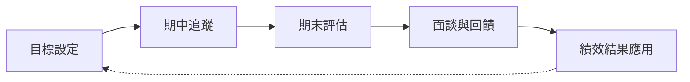

# 績效管理及獎懲程序 (HR-PR-PER-01)

## 一、 目的

本辦法旨在通過對員工的工作表現、工作態度、出勤率及客戶滿意度進行全面的評估，確保公司能夠充分發揮人力資源潛力，提升整體績效，並促進員工個人發展。

## 二、 適用範圍

本辦法適用公司所有在職員工。

### 考核流程圖

本公司考核類型包含：試用期考核、半年度考核、年度考核、績效改善計畫（PIP）。

### 1. 試用期考核
對新進人員到職 3 個月內之工作表現進行適任評估，由直屬主管進行。如合格可予以任職或調動，如不合格則予以資遣或延長考核期最多至 6 個月。

### 2. 半年度考核
各部門主管對所屬人員之工作表現、專長、特性等應詳細考核及記錄，以便適時施以訓練輔導，每隔半年定期考核一次，藉以發掘其才能即適任傾向做為訓練培養及職務調整派任之依據。

#### 考核流程
1. **目標設定**：每個評估周期的開始，前半年的目標設定期間為 12月-1月間、後半年為 6-7月間，員工需與直屬主管面談並一起設定具體的工作目標。
2. **考核回顧**：主管可視各員工狀況在評估周期中期（3-4月及9-10月），安排進行一次中期回顧面談，以確保目標進展順利並能夠提早發現問題做及時的調整。
3. **期末評估**：每個評估周期（7月、1月）結束後，主管將對員工的表現進行綜合評估，並給予具體分數。
4. **回饋與溝通**：評估完成後，主管將與員工進行面談，提供具體回饋，並討論下一次考核的目標及發展計畫。

#### 考核項目與評分標準
**工作表現（總計 80分）**
- **目標達成及工作品質（佔 70分）**：評估員工在評估期內是否達成設定的工作目標、及工作品質是否符合公司標準。
  - **業務部門**：業績達成率 (35分)、業績額度 (20分)、業務開發積極度 (10分)、業務活動辦理品質 (5分)。主管加分項：領導能力/團隊表現 (5分)。
  - **內勤部門（含倉儲）**：作業準確度 (20分)、作業於正常工作時間完成 (10分)、工作目標達成 (40分)。主管加分項：領導能力/團隊表現 (5分)。
- **問題解決能力（佔 10分）**：評估員工在面對工作中的挑戰時，能否迅速、有效地解決問題。

**工作態度（總計 20分）**
- **團隊合作與協作（佔 10分）**：評估員工在團隊中的合作精神。
- **職業發展與學習（佔 5分）**：評估員工在職業發展方面的積極性，主動參與培訓與學習。
- **員工敬業度（佔 5分）**：評估員工是否展現出對公司文化和價值觀的認同和實踐。

**整體表現額外加減分項**
- **內外部客戶回饋**：按次計，依客戶回饋正負面給予 +0.5 ~ -0.5 分。
- **創新**：半年度評估，依創新提案執行成效給予 0 ~ 3 分。
- **主動性**：半年度評估，依主動參與跨部門專案之貢獻給予 0 ~ 3 分。
- **專案成效**：依案數計分 (最高 10 分)，依專案評分 × 專案重要度係數 × 個人貢獻度係數計算 (-5 ~ 5 分)。

### 3. 年度考核
上、下半年度考核之平均分數，即為年度考核參照。平均分數依獎懲條目加減分後，進行五等次評分：
1. **特等**：服務成績優異卓越，有具體事實，成績在 90分以上者。
2. **優等**：服務成績超過要求標準，成績在 80-89者。
3. **甲等**：服務成績合乎要求，達到標準，成績在 70-79者。
4. **乙等**：服務成績雖未達標準，努力改善即可達到，成績在 60-69者。
5. **丙等**：服務成績未達標準，整體成績落後，較難改善者，成績未滿 60者。

評分結果將影響年終獎金之發放係數。

### 4. 績效改善計畫考核 (PIP)
針對考核分數為丙等者、或是連續兩次為乙等者，主管得適時介入安排績效改善計畫，協助員工改善其工作表現。計畫為期三個月，每月皆須評估，職務特殊者可延長至六個月。

## 四、 獎懲

其他與工作績效較無關聯，惟因員工品行、操守等項目，主管認定須另進行獎懲者，申請後經由總經理核准生效，包含下列項目：

### 1. 獎勵
- **嘉獎**：勤奮負責、操守廉潔、熱心服務、愛惜公物等。
- **記小功**：密報竊盜、預防故障、當選模範勞工等。
- **記大功**：特殊貢獻使公司獲重大利益、挽救災害免除重大損失、舉發舞弊等，優予考慮職務升遷。
- **專案敘獎**：對國家社會有特殊貢獻者，專案呈請主管機關獎勵。

### 2. 懲處
- **申誡**：行為不檢、影響公司聲譽情節輕微、服裝不合規定、妨害安寧秩序、不聽合理指揮等。
- **記小過**：疏忽致損耗公物、散佈不利謠言/機密、嚴重影響秩序、惡意攻訐/製造事端、**託人打卡或替人打卡**等。
- **記大過**：招搖撞騙、遺失重要文件/工具致嚴重損失、虛報偽造紀錄、抗命不聽從、酗酒鬧事、故意毀損公物、上班兼營事業等惡意或疏失行為。

## 五、 出勤異常扣分規範

出勤異常將影響定期考核分數，扣分標準如下（每年扣分上限總計為：20分）：

1. **事假**：每年超過 3 日，每日扣 1 分，不足一日按一日計。
2. **病假**：每年超過 6 日，每日扣 0.5 分，不足一日按一日計。
3. **遲到、早退**：
   - 享有 **5 分鐘遲到寬限期**，超過 5 分鐘以上才判定遲到；若當月寬限期內延遲**累計超過 30 分鐘**，亦視同出勤異常。
   - 遲到、早退每 10 分鐘扣 0.1 分，不足 10 分鐘以 10 分鐘計。
4. **忘記打卡**：每月 **3 次（含）以內不扣分**，自第 4 次起，每次扣減 **0.1 ~ 1 分**。
5. **無故缺席重要會議**：每次扣 0.5 分。

## 六、 功過考核與積分換算

1. **大過**：年度績效考核分數扣 10 分。
2. **小過**：年度績效考核分數扣 6 分。
3. **申誡**：年度績效考核分數扣 2 分。
4. **大功**：年度績效考核分數加 5 分及禮金。
5. **小功**：年度績效考核分數加 3 分及禮金。
6. **嘉獎**：年度績效考核分數加 1 分及禮金。

## 七、 晉升與調薪

本公司依業務需要，對於經本公司升級（等）考試及格或考核（績）合格或合於獎勵之員工，得依其能力、考核成績、服務態度、工作勝任程度來進行調薪或調升其職務。
