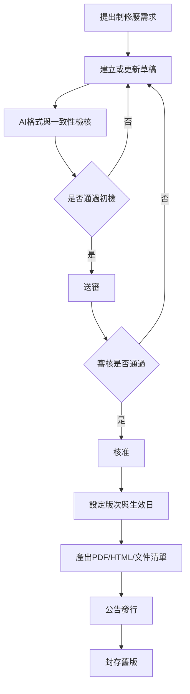

# 文件制修廢管理程序 (HR-PR-QM-01)

## 文件資訊

| 欄位 | 內容 |
| --- | --- |
| 文件編號 | HR-PR-QM-01 |
| 文件名稱 | 文件制修廢管理程序 |
| 文件類型 | 程序書 |
| 版本 | v0.1 |
| 狀態 | 草稿（未發行） |
| 制定單位 | 人事課 |
| 制定者 | 蔡家瑋 |
| 審核者 |  |
| 核准者 |  |
| 生效日 |  |
| 最後更新日 | 2026-07-07 |

## 文件履歷

| 版本 | 日期 | 修訂內容 | 制定者 | 審核者 | 核准者 |
| --- | --- | --- | --- | --- | --- |
| v0.1 | 2026-07-07 | 初版草案建立 | 蔡家瑋 |  |  |

## 一、目的

為確保公司 HR 文件之新增、修訂、廢止、審核、公告、發行及封存均有一致流程，並可由 AI 自動化檢核及產出發行資料，特制定本程序。

## 二、適用範圍

適用於員工手冊、程序書、作業指導書、表單及由既有 Word/PDF SOP 轉入之 HR 相關文件。

## 三、權責

| 角色 | 權責 |
| --- | --- |
| 需求提出人 | 提出新增、修訂或廢止需求，說明原因、影響範圍及預定生效日。 |
| 文件權責單位 | 撰寫文件內容、確認相關文件及維護版次。 |
| 審核者 | 確認制度合理性、法遵風險、跨單位影響及可執行性。 |
| 核准者 | 核准正式發行、重大修訂或廢止。 |
| 文件管理人 | 維護文件清單、發行檔、封存檔及公告紀錄。 |
| AI / 自動化工具 | 協助比對格式、版次、metadata、相關文件與發布輸出。 |

## 四、作業流程

## 五、作業內容

### 5.1 新增文件

新增文件時，應先確認文件類型、編號、權責單位、相關文件及預定生效方式。草稿版次自 `v0.1` 起版，狀態為 `draft`，不得填寫正式生效日。

### 5.2 修訂文件

修訂文件應先判斷修訂等級。文字整理、格式統一或補充說明可作為小版修訂；涉及員工權利義務、核准層級、薪資、出勤、獎懲或法遵要求者，應作為重大修訂並重新審核核准。

### 5.3 廢止文件

文件廢止時，應說明廢止原因、替代文件及停止適用日期。廢止後 metadata 狀態改為 `archived`，並從正式公告清單移至封存清單。

### 5.4 發行與公告

文件核准後，應產出 PDF 或 HTML 發行檔，更新文件清單，並於公告中說明文件名稱、版次、生效日、適用對象及主要異動。Google Sites 顯示版本應以已發行 PDF 或 HTML 為準。

### 5.5 舊版封存

新版生效後，舊版文件應封存並保留可追溯紀錄。封存檔不得與現行有效版混放於同一正式入口。

## 六、紀錄保存

| 紀錄 | 保存單位 | 保存方式 | 保存期間 |
| --- | --- | --- | --- |
| 文件制修廢申請單 | 文件管理人 | Markdown / PDF / Google Drive | 依公司紀錄保存規定 |
| 文件審核發布紀錄表 | 文件管理人 | Markdown / PDF / Google Drive | 依公司紀錄保存規定 |
| 文件清單與版次管制表 | 文件管理人 | Markdown / Sheet / PDF | 持續維護 |
| 文件異動公告 | 文件管理人 | 公告紀錄 / Google Sites | 依公司紀錄保存規定 |

## 七、相關文件

| 文件編號 | 文件名稱 |
| --- | --- |
| HR-WI-QM-01 | 文件控制與Metadata規格 |
| HR-FM-QM-01 | 文件制修廢申請單 |
| HR-FM-QM-02 | 文件審核發布紀錄表 |
| HR-FM-QM-03 | 文件清單與版次管制表 |
| HR-FM-QM-04 | 文件異動公告範本 |
