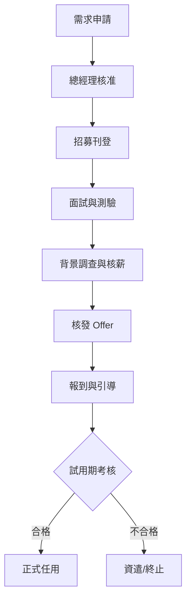

# 員工招募任用程序 (HR-PR-REC-01)

## 一、 目的
為確保公司人力運用符合營運目標，並規範招募甄選及任用流程，確保人才質量，特訂定本程序。

## 二、 適用範圍
本公司全體正式員工之招募與任用。

## 三、 招募任用流程

## 四、 人力需求申請
1. 單位主管應依組織編制與業務需求提出「人力需求申請」，需敘明職位描述 (JD) 與職能要求。
2. 所有人力增補需經 **總經理** 核准後，方可由人資單位執行招募。

## 五、 甄選與面試
1. **背景調查 (Reference Check)**：中高級主管或關鍵職位人員，任用前需進行背景調查，內容包含：過往工作績效、誠信紀錄及離職原因。
2. **任用限制**：嚴禁任用未滿 15 歲之童工；若任用 15~18 歲之童工，需符合勞基法相關規範並徵得監護人同意。
3. **職能定義 (JD)**：各單位在面試時應明確告知該職位之工作內容、權責範圍與試用期考核指標。

## 六、 試用期管理 (內控重點)
1. **試用期限**：新進員工一律試用 **3 個月**。
2. **試用期考核**：
   - 單位主管應於員工到職第 2.5 個月時執行「試用期滿考核」。
   - 考核不合格者，主管應檢附相關具體事證說明。
   - 若不予任用，人資單位需依法於試用期結束前完成資遣或合意終止契約。

## 七、 報到手續
員工報到時應依本公司《新進人員引導清單》(HR-FM-REC-01) 辦理手續，重點項目包含：
1. **個人資料查驗**：身分證影本、學經歷證明原件、前職離職證明、體格檢查報告。
2. **法律文件簽署 (必備)**：
   - 勞動契約書。
   - 營業秘密與保密協議書 (NDA)。
   - 員工誠信經營守則及行為準則簽署。
3. **系統與設備領用**：開通系統權限並領取必要之辦公設備。
