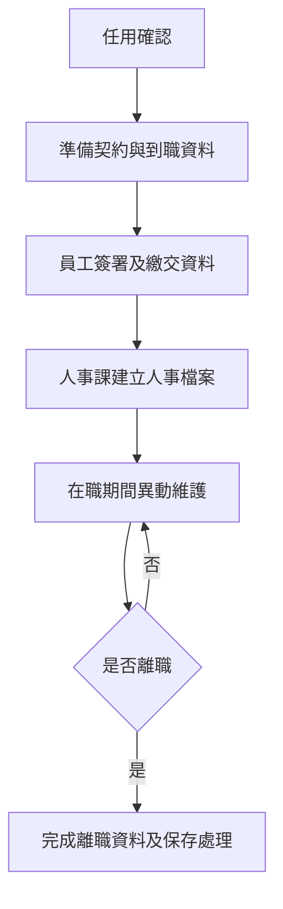

# 勞動契約與人事資料管理程序 (HR-PR-REC-02)

## 文件資訊

| 欄位 | 內容 |
| --- | --- |
| 文件編號 | HR-PR-REC-02 |
| 文件名稱 | 勞動契約與人事資料管理程序 |
| 文件類型 | 程序書 |
| 版本 | v0.1 |
| 狀態 | 草稿（未發行） |
| 制定單位 | 人事課 |
| 制定者 | 蔡家瑋 |
| 審核者 |  |
| 核准者 |  |
| 生效日 |  |
| 最後更新日 | 2026-07-07 |

## 文件履歷

| 版本 | 日期 | 修訂內容 | 制定者 | 審核者 | 核准者 |
| --- | --- | --- | --- | --- | --- |
| v0.1 | 2026-07-07 | 初版草案建立 | 蔡家瑋 |  |  |

## 一、目的

為規範勞動契約簽署、人事資料建立、異動維護、調閱、保存及離職後資料處理，特制定本程序。

## 二、適用範圍

適用於新進、在職、職務異動、薪資異動、留職停薪、離職及其他人事資料管理作業。

## 三、權責

| 角色 | 權責 |
| --- | --- |
| 人事課 | 建立及維護勞動契約、人事資料、異動紀錄及保存權限。 |
| 用人主管 | 確認任用條件、職務內容及異動需求。 |
| 員工 | 提供正確資料，並於資料變更時主動通知人事課。 |
| 財會課 | 依人事資料辦理薪資、保險及相關給付作業。 |

## 四、作業流程

## 五、作業內容

### 5.1 勞動契約

新進人員到職前或到職時，應完成勞動契約、保密、個資、任用條件或其他必要文件簽署。契約內容應與任用條件及公司制度一致。

### 5.2 人事資料建立

人事課應建立員工基本資料、任用資料、職務資料、薪資資料、保險資料、緊急聯絡人及必要附件。

### 5.3 資料異動

員工個人資料、聯絡方式、銀行帳戶、眷屬或其他影響人事作業之資料異動時，員工應主動通知人事課並提供必要證明。

### 5.4 調閱及保存

人事資料調閱應限於業務必要範圍。紙本及電子檔應設置保存位置、權限及備份，離職後資料依公司保存規定處理。

## 六、紀錄保存

| 紀錄 | 保存單位 | 保存方式 | 保存期間 |
| --- | --- | --- | --- |
| 勞動契約及附件 | 人事課 | 紙本或電子檔 | 依公司紀錄保存規定 |
| 人事基本資料 | 人事課 | 系統或電子檔 | 依公司紀錄保存規定 |
| 人事異動紀錄 | 人事課 | 系統或電子檔 | 依公司紀錄保存規定 |

## 七、相關文件

| 文件編號 | 文件名稱 |
| --- | --- |
| HR-PR-REC-01 | 員工招募任用程序 |
| HR-PR-GEN-03 | 個人資料保護管理程序 |
| HR-PR-SEP-01 | 員工離職管理程序 |
