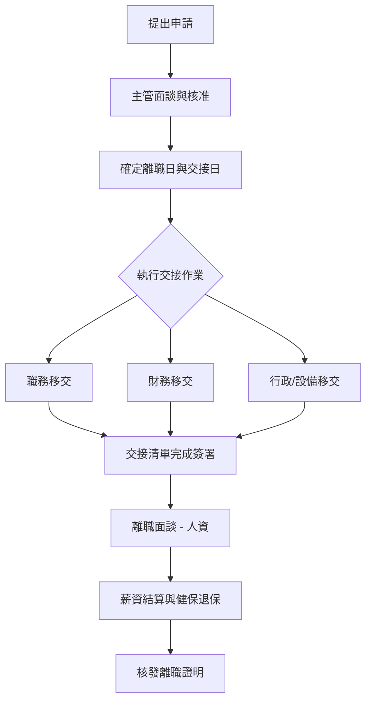

# 員工離職管理程序 (HR-PR-SEP-01)

## 一、 目的
為規範員工離職作業，確保職務交接之完整性、公司資產之安全性，並維護勞雇雙方之權益，特訂定本程序。

## 二、 適用範圍
本公司全體員工。

## 三、 離職作業流程

## 四、 離職預告與申請
1. **預告期限**：員工自願離職應依下列法律規定期間提出申請：
   - 繼續工作三個月以上一年未滿者，於 10 日前預告。
   - 繼續工作一年以上三年未滿者，於 20 日前預告。
   - 繼續工作三年以上者，於 30 日前預告。
2. **申請方式**：透過「104 企業大師」系統提交離職申請，並知會直屬主管。

## 五、 職務交接規範 (核心章節)

離職人員應於預告期間內辦妥下列交接事項，並填寫《員工離職移交清單》(HR-FM-SEP-01)：

### 1. 業務與職務移交 (代理人確認)
- **待辦事項清單**：列出目前進行中之專案、未完成之工作進度及後續預計辦理事項。
- **客戶資料 (業務人員)**：包含客戶聯繫清單、合約內容、未結案報價單、客訴處理進度等。
- **文件檔案**：包含紙本文件歸檔、電子檔案目錄清單。
- **知識傳承**：關鍵作業流程之操作手冊或 Know-how 說明。

### 2. 數位資產與檔案管理
- **雲端與硬碟**：所有公務相關之電子檔案，應全數上傳至部門共享雲端空間或指定之交接磁碟，不得私自刪除或加密。
- **帳號密碼**：交回公務用之帳號密碼，並由資訊單位登銷或修改。
- **Email 自動回覆**：離職前 3 日應設定郵件自動回覆，引導客戶聯繫職務代理人。

### 3. 財務與行政移交
- **財務結算**：結清個人借支、預支費用、暫付金。
- **設備繳回**：筆記型電腦、公務機、鑰匙、員工證、門禁卡、文具設備等。
- **公務車輛**：繳回車匙、行照，並完成車況檢查與清潔。

## 六、 交接確認與責任
1. **簽署確認**：移交清單須經由「移交人」、「接交代理人」及「部門主管」三方簽署確認後，方視為交接完成。
2. **違規處理**：若未依規定辦妥交接即逕行離職，導致公司受有財產或營業秘密之損害，公司將依法追究其民、刑事法律責任，並保留損害賠償請求權。

## 七、 薪資結算與證明核發
1. 薪資將於離職手續完畢後之次月發薪日結清（包含未休特休之折算）。
2. 完成所有交接程序後，員工得請求人資部核發離職證明書。

## 八、 離職面談
人資單位應安排離職面談，了解員工離職真實原因，作為公司改善管理制度之參考。
