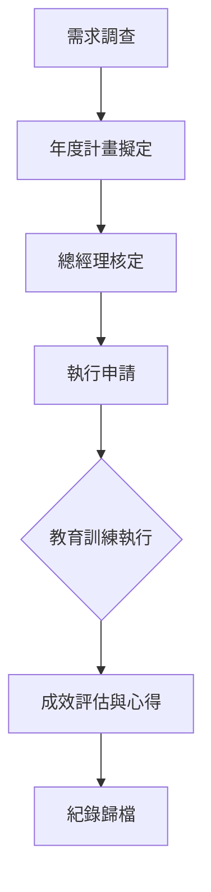

# 教育訓練管理程序 (HR-PR-TRA-01)

## 一、 目的
為提昇員工專業技能、強化組織競爭力，並建立有系統的人才培訓機制，特訂定本程序。

## 二、 適用範圍
本公司全體正式員工。

## 三、 訓練作業流程

1. **新進人員引導訓練 (Orientation)**：包含公司簡介、規章制度、環境介紹、資訊安全訓練等。
2. **專業職能訓練**：針對各部門專業需求進行之技術或業務能力培訓。
3. **管理職能訓練**：針對各級主管進行之領導、管理及決策能力培訓。
4. **通識與法規訓練**：包含性騷擾防治、職安衛訓練、ESG 永續教育等。

## 四、 作業程序
1. **需求調查**：各部門應於每年年底前，依據年度目標提出次年之教育訓練需求。
2. **計畫擬定**：人資單位彙整各部需求，擬定年度教育訓練計畫及預算，經總經理核定後實施。
3. **執行申請**：
   - **內訓**：由公司內部講師或邀請外師至公司授課。
   - **外訓**：員工申請參加外部機構辦理之課程，需填寫《教育訓練申請表》(HR-FM-TRA-01) 經主管核准。

## 五、 訓練成效評估
1. **心得回饋**：參加 4 小時以上之訓練，員工需繳交訓練心得報告或進行部門分享。
2. **滿意度調查**：內訓課程結束後，應由學員填寫課後意見調查表。
3. **訓練紀錄**：所有訓練時數應詳實記錄於個人人事資料庫中，作為晉升或調薪之參考。

## 六、 外訓服務協議
若外訓費用單次超過 **新台幣 20,000 元 (含) 以上**，公司得與員工協議簽訂「服務年限協議書」，約定於訓練結業後須在職服務之期限，未滿期限離職者應依比例賠償訓練費用。
