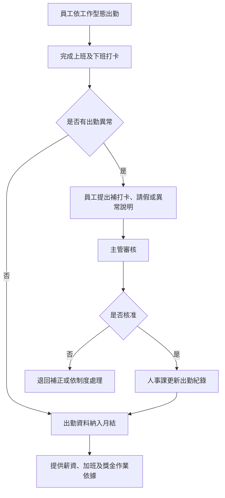

# 員工出勤管理規範 (HR-SP-001)

## 文件資訊

| 欄位 | 內容 |
| --- | --- |
| 文件編號 | HR-SP-001 |
| 文件名稱 | 員工出勤管理規範 |
| 文件類型 | 程序書 |
| 版本 | v0.1 |
| 狀態 | 草稿（未發行） |
| 制定單位 | 人事課 |
| 制定者 | 蔡家瑋 |
| 審核者 |  |
| 核准者 |  |
| 生效日 |  |
| 最後更新日 | 2026-07-07 |

## 文件履歷

| 版本 | 日期 | 修訂內容 | 制定者 | 審核者 | 核准者 |
| --- | --- | --- | --- | --- | --- |
| v0.1 | 2026-07-07 | 依新版文件格式重建出勤管理規範草稿；原來源檔疑似複製他文件內容，不作為正式依據 | 蔡家瑋 |  |  |

## 一、目的

為建立一致之出勤紀錄、異常處理、加班申請及出勤資料保存原則，使員工出勤管理有所依循，特制定本規範。

## 二、適用範圍

本規範適用於公司全體員工。不同工作型態之打卡方式、出勤地點與異常處理，依內勤、外勤、業務及主管核定之工作安排辦理。

## 三、權責

| 角色 | 權責 |
| --- | --- |
| 員工 | 依規定出勤、打卡、請假及加班申請，並主動回報出勤異常。 |
| 直屬主管 | 確認出勤狀況、審核補打卡、請假及加班申請。 |
| 人事課 | 維護出勤制度、彙整出勤紀錄、追蹤異常及保存資料。 |
| 財會課 | 依核定之出勤、加班、請假及獎金資料辦理薪資計算。 |
| 資訊或系統管理單位 | 協助維護打卡系統帳號、權限及系統異常排除。 |

## 四、作業流程

## 五、作業內容

### 5.1 出勤紀錄

員工應依公司規定之上班時間、工作地點及打卡工具記錄出勤。未經核准不得代打卡、委託他人打卡或以不實方式登載出勤紀錄。

### 5.2 內勤及外勤打卡

內勤員工原則上應於公司指定地點或指定網路環境完成打卡。外勤、業務、外派或客戶現場作業人員，得依主管核准之工作安排使用定位、任務紀錄或其他公司指定方式記錄出勤。

### 5.3 出勤異常

忘刷、漏刷、系統異常、外出公務或其他無法正常打卡情形，員工應於發現後儘速提出補打卡或異常說明，並經主管審核後由人事課更新紀錄。

### 5.4 遲到、早退及曠職

遲到、早退及曠職之認定，應依員工管理手冊、請假管理程序及實際出勤紀錄辦理。涉及薪資、全勤、考核或獎懲者，應保留可追溯紀錄。

### 5.5 加班

員工需加班時，應依加班申請作業程序提出申請並經核准後執行。未依程序申請或未經核准之延長工作時間，原則上不列入加班核算。

### 5.6 天然災害及特殊情形

遇颱風、地震、水災、停班停課或其他不可抗力情形，依天然災害出勤及停班停課處理程序辦理。

## 六、紀錄保存

| 紀錄 | 保存單位 | 保存方式 | 保存期間 |
| --- | --- | --- | --- |
| 出勤紀錄 | 人事課 | 出勤紀錄工具或匯出檔 | 依公司紀錄保存規定 |
| 補打卡及異常申請 | 人事課 | 系統紀錄或表單 | 依公司紀錄保存規定 |
| 加班申請紀錄 | 人事課 | 系統紀錄或表單 | 依公司紀錄保存規定 |
| 薪資結算依據 | 財會課 / 人事課 | 薪資作業資料 | 依公司紀錄保存規定 |

## 七、相關文件

| 文件編號 | 文件名稱 |
| --- | --- |
| HR-MN-QM-01 | 員工管理手冊 |
| HR-PR-ATT-01 | 員工請假管理程序 |
| HR-PR-ATT-02 | 員工出勤管理程序 |
| HR-PR-ATT-03 | 業務人員出勤管理程序（已併入 HR-PR-ATT-02） |
| HR-PR-ATT-04 | 加班申請作業程序 |
| HR-PR-ATT-05 | 天然災害出勤及停班停課處理程序 |
| HR-WI-ATT-01 | 104企業大師手機打卡操作指南 |
| HR-FM-ATT-03 | 忘刷補打卡備援申請單 |
